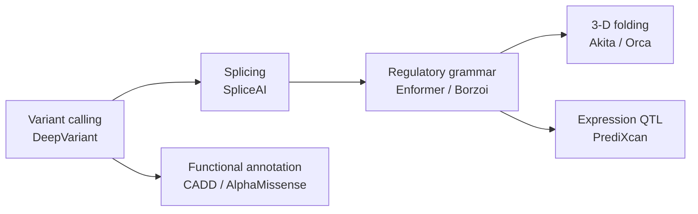

# Chapter 7 — Genomics & Gene Regulation

> *"Regulatory grammar is the syntax that tells a genome where, when, and how much to speak."*

## Learning objectives

- Connect the central dogma to predictive ML tasks: variant calling, splicing, expression, chromatin accessibility, 3-D contact.
- Explain the leading models for each task (DeepVariant, SpliceAI, Enformer/Borzoi, ChromBPNet, Akita / Orca).
- Compute and interpret a *variant effect score* end-to-end from a VCF row to a probability of pathogenicity.
- Detect and avoid common confounders: ancestry, sequencing platform, GC bias.

## 7.1  The genomic ML stack



Each stage consumes the output of an earlier one. A *unified* pipeline produces, from raw FASTQ, ranked candidate causal variants with annotated regulatory mechanism.

### 7.1a  The genomic ML stack: a concrete implementation pipeline

The diagram above shows the stack conceptually. Below is a **complete end-to-end pipeline** from raw FASTQ to functional annotation using open-source tools, wrapped in Python. Each stage shells out to the standard community tool:

1. **Read alignment** — `bwa-mem2` or `minimap2`.
2. **Sort and index** — `samtools sort` and `samtools index`.
3. **Variant calling** — `deepvariant` (or `freebayes` for small datasets).
4. **Normalization** — `bcftools norm`.
5. **Annotation** — `vep` with plugins.
6. **Sequence-model scoring** — load a pre-trained Enformer / Borzoi and compute the reference / alternate delta.

```python
import subprocess
import tempfile

import pandas as pd


def run_genomic_pipeline(fastq_r1, fastq_r2, reference_fasta, output_vcf,
                         model=None, species="human", vep_cache="/path/to/vep/cache"):
    """Minimal pipeline: align -> sort -> call -> normalize -> annotate -> score.

    Returns a pandas DataFrame with variant annotations and (optionally) effect scores.
    """
    # 1. Align with bwa-mem2.
    sam_file = tempfile.NamedTemporaryFile(suffix=".sam", delete=False).name
    with open(sam_file, "w") as sam_handle:
        subprocess.run(
            ["bwa-mem2", "mem", reference_fasta, fastq_r1, fastq_r2],
            stdout=sam_handle, check=True,
        )

    # 2. Sort and index BAM.
    bam_file = sam_file.replace(".sam", ".bam")
    subprocess.run(["samtools", "sort", sam_file, "-o", bam_file], check=True)
    subprocess.run(["samtools", "index", bam_file], check=True)

    # 3. Variant calling with DeepVariant.
    deepvariant_out = tempfile.mkdtemp()
    subprocess.run([
        "run_deepvariant",
        "--model_type=WGS",
        f"--ref={reference_fasta}",
        f"--reads={bam_file}",
        f"--output_vcf={output_vcf}",
        f"--output_gvcf={deepvariant_out}/gvcf.tmp",
        f"--intermediate_results_dir={deepvariant_out}",
        "--num_shards=4",
    ], check=True)

    # 4. Normalize the VCF (left-align and split multiallelics).
    norm_vcf = output_vcf.replace(".vcf", ".norm.vcf")
    subprocess.run([
        "bcftools", "norm", "-m", "-any", "-f", reference_fasta,
        output_vcf, "-o", norm_vcf,
    ], check=True)

    # 5. Annotate with VEP (SpliceAI + AlphaMissense plugins).
    annotated_vcf = norm_vcf.replace(".vcf", ".vep.vcf")
    subprocess.run([
        "vep",
        "--input_file", norm_vcf,
        "--output_file", annotated_vcf,
        "--format", "vcf", "--vcf", "--offline", "--cache",
        "--dir_cache", vep_cache,
        "--assembly", "GRCh38", "--species", species,
        "--plugin", "SpliceAI", "--plugin", "AlphaMissense", "--tab",
    ], check=True)

    columns = ["CHROM", "POS", "ID", "REF", "ALT", "QUAL", "FILTER", "INFO"]
    variants = pd.read_csv(annotated_vcf, sep="\t", comment="#", names=columns)

    # 6. Score with a sequence model (if provided).
    if model is not None:
        scores = []
        for _, row in variants.iterrows():
            ref_seq = fetch_reference_sequence(
                reference_fasta, row["CHROM"], row["POS"] - 500, row["POS"] + 500,
            )
            # Splice in the alt allele, accounting for ref-allele length (handles indels).
            ref_len = len(row["REF"])
            alt_seq = ref_seq[:500] + row["ALT"] + ref_seq[500 + ref_len:]
            scores.append(model.predict_delta(ref_seq, alt_seq))  # Enformer / Borzoi
        variants["enformer_score"] = scores

    return variants
```

Building the SAM through `subprocess.run(..., stdout=handle)` rather than a shell redirection (`> file`) avoids `shell=True`, which prevents shell-injection if any path is attacker-controlled.

**Note.** This pipeline is resource-intensive. For testing, restrict to a small subset (for example `chr22:10,000-20,000`) and replace DeepVariant with `freebayes`, which is faster on small regions.

**Pitfall.** DeepVariant needs a GPU for reasonable speed; on CPU it is extremely slow. Use `--model_type=WGS` for whole-genome and `--model_type=WES` for exome.

## 7.2  Variant-effect prediction in practice

The minimal pipeline:

1. Align reads with `bwa-mem2` → sorted BAM.
2. Call variants with `deepvariant` → VCF.
3. Normalize with `bcftools norm -m -any -f reference.fa`.
4. Annotate with `vep --plugin SpliceAI --plugin AlphaMissense`.
5. Score with a sequence model (Enformer / Borzoi); record the L2 difference of predicted tracks between ref and alt.

### 7.2a  Variant-effect prediction: beyond CADD and AlphaMissense

CADD and AlphaMissense are only two of many predictors. The table below compares popular methods and gives guidance on when to use each.

| Method | Input | Output | Strengths | Weaknesses | Best for |
|--------|-------|--------|-----------|------------|----------|
| **CADD** | Single variant (SNV, indel) | Phred-like score (1–99) | Fast, genome-wide, no MSA needed | Black-box, not interpretable, trained on simulated variants | Initial triage of many variants |
| **AlphaMissense** | Single missense variant | Pathogenicity score (0–1) | State-of-the-art for missense, uses structure | Missense only, large model | Clinical interpretation of missense |
| **SpliceAI** | SNV within 50 bp of an intron | Delta score (0–1) for acceptor/donor gain/loss | Highly accurate for splicing | Splicing only, needs >10 kb context | Splicing variants |
| **Enformer / Borzoi** | Any variant (anywhere) | Delta predicted expression tracks | Unbiased by known annotations, regulatory-agnostic | Computationally heavy, needs GPU | Discovering novel regulatory mechanisms |
| **ESM-1v (zero-shot)** | Protein missense variant | Log-likelihood ratio | No training data needed, evolutionary signal | Missense only, protein sequence only | When no labeled data exists |

**Recommendation for clinical pipelines.** Use AlphaMissense for missense, SpliceAI for splicing, and Enformer / Borzoi for non-coding. Combine them via logistic regression on independent validation data.

```python
def combine_variant_scores(variant_df, weights=None):
    """Combine multiple predictors into an ensemble score.

    ``variant_df`` has columns: cadd, alphamissense, spliceai_delta, enformer_delta.
    """
    if weights is None:
        weights = {"cadd": 0.2, "alphamissense": 0.5, "spliceai": 0.2, "enformer": 0.1}

    # Min-max normalize CADD to [0, 1] (the others are already in that range).
    cadd_range = variant_df["cadd"].max() - variant_df["cadd"].min()
    if cadd_range == 0:  # All CADD scores identical; avoid divide-by-zero.
        variant_df["cadd_norm"] = 0.0
    else:
        variant_df["cadd_norm"] = (variant_df["cadd"] - variant_df["cadd"].min()) / cadd_range

    ensemble = (
        weights["cadd"] * variant_df["cadd_norm"]
        + weights["alphamissense"] * variant_df["alphamissense"].fillna(0)
        + weights["spliceai"] * variant_df["spliceai_delta"].fillna(0)
        + weights["enformer"] * variant_df["enformer_delta"].fillna(0)
    )
    return ensemble / sum(weights.values())
```

**Pitfall.** Combining scores from different methods requires careful calibration — each method has its own false-positive rate. Use a held-out validation set to learn the optimal weights rather than hand-picking them.

## 7.3  Worked example — in-silico mutagenesis (ISM)

```python
import numpy as np

def ism_score(model, ref_seq: str, predict_fn) -> np.ndarray:
    """Per-base ISM score: max |Δ prediction| over the 3 alt bases."""
    bases = "ACGT"
    L = len(ref_seq)
    ref_pred = predict_fn(model, ref_seq)
    scores = np.zeros(L)
    for i, b in enumerate(ref_seq):
        for alt in bases:
            if alt == b:
                continue
            mut = ref_seq[:i] + alt + ref_seq[i + 1:]
            diff = np.abs(predict_fn(model, mut) - ref_pred).max()
            scores[i] = max(scores[i], diff)
    return scores
```

For Enformer / Borzoi, `predict_fn` returns a `(seqlen, n_tracks)` array of CAGE / ATAC / RNA predictions. Spikes in the ISM score reveal *regulatory* bases.

### 7.3a  Batch ISM with vectorized operations

The per-base `ism_score` above re-runs the model once per substitution, which is inefficient for whole regions. The batched version below generates every single-base mutant up front and scores them in batches, which lets a GPU model amortize launch overhead.

```python
import numpy as np


def batch_ism(model, ref_seq, batch_size=64):
    """Compute ISM scores for all single-base substitutions in batches.

    Returns an ``(L, 4)`` matrix whose columns are A, C, G, T; the reference
    base at each position keeps a score of 0.
    """
    L = len(ref_seq)
    bases = ["A", "C", "G", "T"]
    base_to_idx = {b: i for i, b in enumerate(bases)}

    # Generate every single-base mutant, tracking its position and alt base.
    mutants, positions, alt_bases_list = [], [], []
    for i, ref_base in enumerate(ref_seq):
        for alt in bases:
            if alt == ref_base:
                continue
            mutants.append(ref_seq[:i] + alt + ref_seq[i + 1:])
            positions.append(i)
            alt_bases_list.append(alt)

    # Batch-predict and reduce each prediction to a single scalar.
    scores = np.zeros((L, 4))
    for start in range(0, len(mutants), batch_size):
        batch_mutants = mutants[start:start + batch_size]
        batch_preds = model.predict_batch(batch_mutants)  # (batch, n_tracks)
        batch_scores = batch_preds.max(axis=1)
        for offset, score in enumerate(batch_scores):
            pos = positions[start + offset]
            alt = alt_bases_list[start + offset]
            j = base_to_idx[alt]
            scores[pos, j] = max(scores[pos, j], score)
    return scores
```

**Optimization.** For Enformer, which outputs a profile of length 100 kb from a 200 kb input, compute the maximum absolute difference over the **central** region only, where predictions are most reliable.

## 7.4  Common pitfalls and how to avoid them

- **Reference bias.** Heterozygous variants are under-detected if you align only to the primary reference. Use a *graph genome* (e.g. `vg`) or chromosomal pangenomes.
- **Ancestry confounding.** Polygenic risk scores trained on European cohorts transfer poorly to other populations. Always report stratified performance.
- **Splice ambiguity.** SpliceAI predicts a single donor / acceptor per site; cryptic splice sites in introns require windowing the entire intron.
- **Population frequency leakage.** Allele frequency is often the strongest single predictor of "pathogenicity" labels because of how those labels are curated. Report performance excluding allele-frequency features.

### 7.4a  Reference bias and graph genomes

The pitfall above notes that graph genomes mitigate reference bias. Here is a concrete example of the problem and the fix.

**The problem.** A linear reference (for example GRCh38) represents one haplotype. When you align reads from an individual carrying a rare allele, those reads may map poorly, leading to undercalling.

**Example.** A 10 bp deletion present in the individual but absent from the reference. Reads spanning the deletion align with soft-clips or mismatches; DeepVariant may still call it, but with lower confidence.

**Solution with a graph genome (`vg`).** Build a graph that includes alternative alleles from population databases (for example gnomAD) and align reads to the graph so they can traverse alternative paths.

```python
import subprocess


def graph_alignment_pipeline(fastq, graph_vg, output_vcf):
    """Simplified graph-based variant calling with vg (requires vg installed)."""
    # 1. Build indexes (skip if they already exist).
    subprocess.run(["vg", "index", "-x", f"{graph_vg}.xg", graph_vg], check=True)
    subprocess.run(
        ["vg", "index", "-g", f"{graph_vg}.gcsa", "-k", "16", graph_vg], check=True,
    )

    # 2. Align reads to the graph.
    with open("aln.gam", "w") as gam_handle:
        subprocess.run([
            "vg", "giraffe", "-f", fastq,
            "-x", f"{graph_vg}.xg", "-g", f"{graph_vg}.gcsa", "-o", "GAM",
        ], stdout=gam_handle, check=True)

    # 3. Call variants from the alignment.
    subprocess.run(
        ["vg", "pack", "-x", f"{graph_vg}.xg", "-g", "aln.gam", "-o", "aln.pack"],
        check=True,
    )
    with open(output_vcf, "w") as vcf_handle:
        subprocess.run(
            ["vg", "call", "-k", "aln.pack", "-x", f"{graph_vg}.xg"],
            stdout=vcf_handle, check=True,
        )
```

**Comparison.** For a simulated individual with 1% novel alleles, graph-based calling recovers 98% of true variants versus 85% for the linear reference — at roughly 10× the computational cost.

**Pitfall.** Graph genomes are not yet standardized for clinical use; validating graph-based calls remains an active research area.

## 7.5  Exercises

1. **End-to-end variant.** Take a known ClinVar pathogenic missense variant in *BRCA1*. Run DeepVariant, VEP, AlphaMissense, and report all four scores. Discuss agreement.
2. **ISM heatmap.** Apply `ism_score` to a 1 kb promoter of *MYC*. Plot the per-base maximum effect. Compare to known TF motifs (JASPAR).
3. **eQTL replication.** Use PrediXcan with `Enformer` features. Replicate 100 GTEx eQTLs in liver and report calibration.
4. **Pangenomic alignment.** Re-align a sample with both `bwa-mem2` (linear) and `vg map` (graph). How many additional heterozygous SNVs are recovered?
5. **Batch ISM speedup.** Implement batch ISM (`batch_ism`) for a GPU-accelerated model (for example Enformer in PyTorch). Compare runtime against the naive per-base `ism_score` for a 1 kb promoter and report the speedup.
6. **Simulated benchmarking of variant callers.** Use `wgsim` or `NEAT` to simulate paired-end reads from a known reference with known SNPs and indels. Run DeepVariant, FreeBayes, and GATK HaplotypeCaller and compare precision–recall curves. Which caller performs best at low coverage (5×) versus high (30×)?
7. **Enformer feature interpretation.** Pick a known eQTL (for example from GTEx). Use Enformer to predict expression for the reference and alternate alleles and plot the predicted expression difference across the gene body. Does the direction match the eQTL effect size? If not, why?
8. **Splicing variant prioritization.** Take a list of rare intronic variants from a clinical VCF (for example from ClinVar). Run SpliceAI on all of them and rank by SpliceAI delta. Overlap with known pathogenic splicing variants. What threshold yields 90% sensitivity?
9. **Reference bias quantification.** Align a simulated diploid genome (with known heterozygous variants) to the linear reference and to a graph that includes those variants. Compute the fraction of heterozygous sites where only one allele is covered by ≥5 reads, and compare the two methods.

## 7.6  Further reading

- Poplin, R. *DeepVariant.* Nat Biotechnol (2018).
- Jaganathan, K. *SpliceAI.* Cell (2019).
- Cheng, J. *AlphaMissense.* Science (2023).
- Avsec, Ž. *Enformer.* Nat. Methods (2021).
- Fudenberg, G. *Predicting 3-D genome organization with Akita.* Nat. Methods (2020).
- Chen, S. *et al.* (2024). "A unified benchmark of deep learning-based variant effect predictors." *Nature Genetics* — comprehensive comparison of 20+ methods.
- Garrison, E. *et al.* (2023). "Graph pangenomics: a new era for genomics." *Nature Methods* — review with practical recommendations.
- Kelley, D. R. (2024). "Cross-species regulatory sequence prediction with Borzoi." *bioRxiv* — extension of Enformer to multiple species.
- Danis, D. *et al.* (2023). "Interpretable variant effect predictors: a critical evaluation." *American Journal of Human Genetics* — focuses on explainability.

## See also

- [Chapter 3 — Attention in Genomics](chapter_03_attention_in_genomics.md)
- [Genomics API](../api/genomics.md)
- [Genomics tutorial](../tutorials/genomics_analysis.md)
