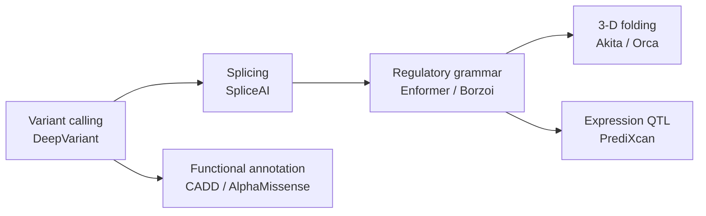

# Chapter 7 — Genomics & Gene Regulation

> *"Regulatory grammar is the syntax that tells a genome where, when, and how much to speak."*

## Learning objectives

- Connect the central dogma to predictive ML tasks: variant calling, splicing, expression, chromatin accessibility, 3-D contact.
- Explain the leading models for each task (DeepVariant, SpliceAI, Enformer/Borzoi, ChromBPNet, Akita / Orca).
- Compute and interpret a *variant effect score* end-to-end from a VCF row to a probability of pathogenicity.
- Detect and avoid common confounders: ancestry, sequencing platform, GC bias.

## 7.1  The genomic ML stack



Each stage consumes the output of an earlier one. A *unified* pipeline produces, from raw FASTQ, ranked candidate causal variants with annotated regulatory mechanism.

## 7.2  Variant-effect prediction in practice

The minimal pipeline:

1. Align reads with `bwa-mem2` → sorted BAM.
2. Call variants with `deepvariant` → VCF.
3. Normalize with `bcftools norm -m -any -f reference.fa`.
4. Annotate with `vep --plugin SpliceAI --plugin AlphaMissense`.
5. Score with a sequence model (Enformer / Borzoi); record the L2 difference of predicted tracks between ref and alt.

## 7.3  Worked example — in-silico mutagenesis (ISM)

```python
import numpy as np

def ism_score(model, ref_seq: str, predict_fn) -> np.ndarray:
    """Per-base ISM score: max |Δ prediction| over the 3 alt bases."""
    bases = "ACGT"
    L = len(ref_seq)
    ref_pred = predict_fn(model, ref_seq)
    scores = np.zeros(L)
    for i, b in enumerate(ref_seq):
        for alt in bases:
            if alt == b:
                continue
            mut = ref_seq[:i] + alt + ref_seq[i + 1:]
            diff = np.abs(predict_fn(model, mut) - ref_pred).max()
            scores[i] = max(scores[i], diff)
    return scores
```

For Enformer / Borzoi, `predict_fn` returns a `(seqlen, n_tracks)` array of CAGE / ATAC / RNA predictions. Spikes in the ISM score reveal *regulatory* bases.

## 7.4  Common pitfalls and how to avoid them

- **Reference bias.** Heterozygous variants are under-detected if you align only to the primary reference. Use a *graph genome* (e.g. `vg`) or chromosomal pangenomes.
- **Ancestry confounding.** Polygenic risk scores trained on European cohorts transfer poorly to other populations. Always report stratified performance.
- **Splice ambiguity.** SpliceAI predicts a single donor / acceptor per site; cryptic splice sites in introns require windowing the entire intron.
- **Population frequency leakage.** Allele frequency is often the strongest single predictor of "pathogenicity" labels because of how those labels are curated. Report performance excluding allele-frequency features.

## 7.5  Exercises

1. **End-to-end variant.** Take a known ClinVar pathogenic missense variant in *BRCA1*. Run DeepVariant, VEP, AlphaMissense, and report all four scores. Discuss agreement.
2. **ISM heatmap.** Apply `ism_score` to a 1 kb promoter of *MYC*. Plot the per-base maximum effect. Compare to known TF motifs (JASPAR).
3. **eQTL replication.** Use PrediXcan with `Enformer` features. Replicate 100 GTEx eQTLs in liver and report calibration.
4. **Pangenomic alignment.** Re-align a sample with both `bwa-mem2` (linear) and `vg map` (graph). How many additional heterozygous SNVs are recovered?

## 7.6  Further reading

- Poplin, R. *DeepVariant.* Nat Biotechnol (2018).
- Jaganathan, K. *SpliceAI.* Cell (2019).
- Cheng, J. *AlphaMissense.* Science (2023).
- Avsec, Ž. *Enformer.* Nat. Methods (2021).
- Fudenberg, G. *Predicting 3-D genome organization with Akita.* Nat. Methods (2020).

## See also

- [Chapter 3 — Attention in Genomics](chapter_03_attention_in_genomics.md)
- [Genomics API](../api/genomics.md)
- [Genomics tutorial](../tutorials/genomics_analysis.md)
