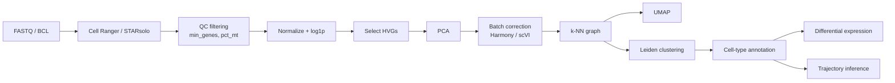

# Chapter 9 — Cellular Systems & Single-Cell Intelligence

> *"Bulk RNA-seq tells us what a tissue is on average; single-cell tells us who lives there."*

## Learning objectives

- Walk through an end-to-end single-cell analysis: QC, normalization, embedding, clustering, annotation, differential expression, trajectory.
- Compare the four leading foundation models for single cells: scVI, scGPT, Geneformer, scFoundation.
- Quantify and remove batch effects using both classical (Harmony) and deep (scVI) methods.
- Critically evaluate cell-type annotation produced by an LLM-style model.

## 9.1  The canonical pipeline



### 9.1a  Extending the pipeline with quality-control diagnostics

The pipeline above (QC → normalization → HVG → PCA → batch correction → graph → UMAP → clustering → annotation → DE → trajectory) is sound. Adding **diagnostic metrics at each stage** helps catch problems early.

| Stage | Diagnostic | What to check | Action if fails |
|-------|------------|---------------|-----------------|
| **QC filtering** | % mitochondrial reads per cell | Distribution; high outlier cells indicate apoptosis or stress | Increase threshold (e.g. 5% → 10%) or remove those cells |
| **Normalization** | Library-size distribution | Should be roughly log-normal; extreme outliers indicate technical failure | Remove cells with library size < 500 UMIs or > 50,000 |
| **HVG selection** | Variance vs. mean plot | Top variable genes should not be dominated by ribosomal/mitochondrial genes | Exclude known unwanted genes from the HVG list |
| **Batch correction** | kBET or graph connectivity | Batch-mixing score should be high (> 0.8) | Try a different method (Harmony vs. scVI vs. BBKNN) |
| **Clustering** | Silhouette score, modularity | Clusters should have silhouette > 0.2 (well-separated) | Adjust resolution or change graph (k = 15 vs. k = 30) |
| **Doublet detection** | Scrublet doublet score | Expected doublet rate ~5–10% for 10x; > 20% suggests a problematic sample | Remove cells with high doublet score |

```python
def pipeline_diagnostics(adata, batch_key='sample', doublet_scores=None):
    """Print diagnostics after each major step."""
    print(f"Cells after QC: {adata.n_obs}, genes: {adata.n_vars}")
    print(f"Median UMIs per cell: {adata.obs['n_counts'].median():.0f}")
    print(f"Median genes per cell: {adata.obs['n_genes'].median():.0f}")
    print(f"Mitochondrial % (median): {adata.obs['pct_counts_mt'].median():.2f}%")

    # Batch mixing
    from sklearn.metrics import silhouette_score
    if 'X_emb' in adata.obsm:  # after integration
        sil = silhouette_score(adata.obsm['X_emb'], adata.obs[batch_key])
        print(f"Batch silhouette (should be low, indicates mixing): {sil:.3f}")
    else:
        print("No integrated embedding found")

    # Doublet rate (if provided)
    if doublet_scores is not None:
        high_conf = doublet_scores > 0.5
        print(f"Predicted doublet rate: {high_conf.mean():.2%}")
```

> **Pitfall.** High mitochondrial percentage (> 10–20%) is normal in certain cell types (e.g. hepatocytes, cardiomyocytes). Do not blindly remove cells without considering biology — always check marker genes.

## 9.2  Foundation models for single cells

| Model | Backbone | Training corpus | Strengths |
|-------|----------|------------------|-----------|
| scVI | VAE | Per-study | Probabilistic; integrates batches; lightweight |
| scGPT | Transformer | 33 M cells | Zero-shot annotation; perturbation prediction |
| Geneformer | BERT | 30 M cells | Gene-network reasoning; in-silico KOs |
| scFoundation | Transformer + read-depth encoder | 50 M cells | Robust across depths |

### 9.2a  Extended comparison and practical recommendations

| Model | Architecture | Pre-training data | Input | Output | Best for | Limitations |
|-------|--------------|-------------------|-------|--------|----------|-------------|
| **scVI** | VAE (ZINB likelihood) | None (per-dataset) | Raw counts | Denoised latent (10–30 dim) | Integration, differential expression | Not a foundation model; trains per dataset |
| **scGPT** | GPT (decoder-only) | 10 M cells (cellxgene) | Gene tokens + expression bins | Generated expression, cell type | Zero-shot annotation, perturbation prediction | Large (100 M params); tokenization loses fine expression differences |
| **Geneformer** | BERT (encoder-only) | 30 M cells (Genecorpus) | Ranked gene expression | Contextual embeddings (256 dim) | Network biology, disease prediction | Requires rank normalization; not for absolute expression |
| **scFoundation** | Transformer (encoder) | 50 M cells | Gene expression | 512-dim embeddings | Broad transfer, imputation | Very large (1 B+ params); high compute |
| **UCE** (Universal Cell Embedding) | Contrastive (CNN) | 100 M cells | Raw counts | 256-dim embeddings | Cross-dataset integration | Not openly available in all frameworks |
| **scimilarity** | Contrastive (MLP) | 20 M cells (multiple tissues) | Log-normalized | 256-dim embeddings | Query-to-reference mapping | Best for human; species transfer limited |

**Recommendation hierarchy.**

1. **Standalone dataset without external reference:** use scVI (fast, interpretable, works with 10k–100k cells).
2. **Zero-shot cell-type annotation in human:** use scGPT or Geneformer with a pre-trained checkpoint; fine-tune if needed.
3. **Cross-dataset integration (e.g. atlas building):** use scVI with adversarial training, or UCE if available.
4. **Limited compute (laptop, < 10k cells):** use PCA + Harmony (classical) — foundation models are overkill.

```python
# Example: using scVI on a new dataset
import scvi
scvi.model.SCVI.setup_anndata(adata, batch_key="batch")
model = scvi.model.SCVI(adata, n_latent=30, n_layers=2, dropout_rate=0.1)
model.train(max_epochs=100, early_stopping=True)
adata.obsm["X_scVI"] = model.get_latent_representation()

# For scGPT zero-shot annotation (simplified)
# from scgpt.model import load_pretrained
# model = load_pretrained("scgpt_human")
# cell_type_probs = model.predict_celltypes(adata, reference_celltypes=celltype_list)
```

> **Pitfall.** Foundation models pre-trained on healthy human tissue may perform poorly on diseased tissue, pediatric samples, or other species. Always validate on a held-out subset of your own data.

## 9.3  Worked example — PBMC 3 k with scVI

```python
import scanpy as sc
import scvi

adata = sc.read_h5ad("data/silver/pbmc3k.h5ad")
scvi.model.SCVI.setup_anndata(adata, batch_key="sample")
model = scvi.model.SCVI(adata, n_latent=10, n_layers=2)
model.train(max_epochs=100, early_stopping=True)
adata.obsm["X_scvi"] = model.get_latent_representation()
sc.pp.neighbors(adata, use_rep="X_scvi")
sc.tl.umap(adata)
sc.tl.leiden(adata, resolution=0.5)
```

`X_scvi` is a denoised, batch-corrected 10-D embedding suitable for downstream tasks.

### 9.3a  Multi-omics integration (CITE-seq) with totalVI

The PBMC example above is transcriptome-only. CITE-seq measures **RNA + protein (ADTs)** in the same cells; `totalVI` (an scVI extension) learns a joint latent representation across both modalities, enabling:

- denoising of both measurements,
- prediction of missing protein from RNA (or vice versa),
- batch correction across experiments with different antibody panels.

```python
import scvi
from scvi.model import TOTALVI

# Assume adata has:
#   adata.X = RNA counts
#   adata.obsm['protein_expression'] = (n_cells, n_proteins) ADT counts
adata.obsm['protein_expression'] = protein_counts  # raw counts

# Setup TOTALVI model (combines RNA and protein)
scvi.model.TOTALVI.setup_anndata(
    adata,
    batch_key="batch",
    protein_expression_obsm_key="protein_expression",
)
model = TOTALVI(adata, n_latent=30, n_layers=2)
model.train(max_epochs=200)

# Joint latent representation (integrates both modalities)
latent = model.get_latent_representation()  # (n_cells, 30)
adata.obsm["X_totalVI"] = latent

# Denoise protein expression
denoised_protein = model.get_normalized_expression(
    transform_batch=None,
    n_samples=25,
    return_mean=True,
)[0]  # (n_cells, n_proteins)

# Predict missing protein (if some proteins not measured)
# Not directly in TOTALVI, but can be done by training a separate head
```

**Evaluation.** Compare Leiden clustering on the joint latent vs. the RNA-only latent. For PBMC, the joint latent should better separate rare cell types (e.g. pDCs) that are defined by surface proteins (CD123, CD303).

## 9.4  Annotation strategies, ranked

1. **Reference mapping** (e.g. `scArches`, `Symphony`) — best when a high-quality atlas exists.
2. **Marker-based** (`scanpy.tl.rank_genes_groups`) — interpretable but brittle to dropout.
3. **Foundation model zero-shot** (scGPT, scimilarity) — convenient but check confusion with rare types.
4. **Manual + expert** — still required for novel tissues.

A defensible workflow uses (1)+(3) for an initial guess and (2)+(4) to validate.

### 9.4a  Reference mapping with scArches

`scArches` (single-cell architecture surgery) projects query data onto a pre-trained reference atlas. **Use case:** you have a new dataset (e.g. PBMC from a lupus patient) and a high-quality reference atlas (e.g. the Human Cell Atlas). Instead of re-clustering from scratch, you map the query cells onto the reference latent space.

**Steps.**

1. Obtain a pre-trained scVI model on the reference atlas (the full model, not just the latent).
2. Load the reference model.
3. Use `scvi.model.SCVI.load_query_data` to map query cells onto the reference latent space.
4. Transfer annotations via nearest neighbour in latent space.

```python
import scvi
# Assume reference_model is a pre-trained SCVI object
# Query data: adata_query (raw counts, same genes as reference)

# Prepare query with same gene vocabulary
scvi.model.SCVI.prepare_query_anndata(adata_query, reference_model.adata)
# Load query into reference model
query_model = scvi.model.SCVI.load_query_data(adata_query, reference_model)

# Latent representation for query cells (aligned to reference)
query_latent = query_model.get_latent_representation()

# Transfer cell-type labels from reference to query (k-NN)
from sklearn.neighbors import NearestNeighbors
ref_latent = reference_model.get_latent_representation()
ref_labels = reference_model.adata.obs['cell_type']

nn = NearestNeighbors(n_neighbors=5, metric='cosine')
nn.fit(ref_latent)
dist, idx = nn.kneighbors(query_latent)
# Majority vote
query_labels = [ref_labels.iloc[i].mode()[0] for i in idx]

adata_query.obs['scArches_prediction'] = query_labels
```

**Validation.** Compare predictions to manual annotation on a small subset (e.g. 500 cells). Expect > 85% accuracy for cell types present in the reference.

> **Pitfall.** scArches assumes the reference and query share most genes. If the query uses a different panel (e.g. a targeted panel vs. full transcriptome), performance drops. Use gene subsetting or imputation.

## 9.5  Trajectory and dynamics

For continuous biology (differentiation, immune activation):

- `scvelo` (steady-state and dynamical) gives RNA velocity.
- `palantir`, `cellrank` build fate-probability maps from a Markov chain on the k-NN graph.
- `dynamo` lifts to a continuous vector field — usable with the neural ODE recipes from Chapter 6.

Always sanity-check velocities at boundaries (terminal cell types should be sinks).

### 9.5a  RNA velocity diagnostics

**Common failure modes of RNA velocity.**

- **Unspliced/spliced ratio saturation** — if unspliced counts are too low (common in 3′ assays like 10x v2), velocity estimates are noisy.
- **Cell-cycle confounders** — proliferating cells have high unspliced counts for cell-cycle genes, creating spurious velocity fields.
- **Incorrect dynamics assumption** — the steady-state model assumes constant transcriptional rates; for complex dynamics, use the dynamical model.

**Diagnostics to run after scVelo.**

1. **Confidence score distribution.** scVelo computes a confidence score (cosine similarity to expected dynamics). Cells with confidence < 0.3 should be excluded from downstream analysis.
2. **Velocity coherence.** For each cell, compute the correlation between its velocity vector and the direction to its future cell state (in diffusion pseudotime). This should be positive.
3. **Terminal-cell sanity check.** In a differentiation trajectory, terminal cell types should have velocities pointing toward themselves (zero net direction). Plot velocity streamlines on UMAP; if arrows point out of terminal clusters, something is wrong.

```python
import numpy as np
import scvelo as scv

def velocity_diagnostics(adata, basis='umap'):
    """Run standard velocity diagnostics and print warnings."""
    scv.tl.velocity_confidence(adata)
    low_conf = (adata.obs['velocity_confidence'] < 0.3).sum()
    print(f"Low confidence cells (<0.3): {low_conf}/{adata.n_obs} "
          f"({100 * low_conf / adata.n_obs:.1f}%)")

    scv.tl.velocity_pseudotime(adata)
    # Coherence: correlation between velocity and direction to future
    # (simplified — actual implementation uses the graph)
    if 'velocity_self_transition' in adata.obs:
        bad_cells = adata.obs['velocity_self_transition'] < 0
        print(f"Cells with negative self-transition (inconsistent): {bad_cells.sum()}")

    # Terminal check: high-confidence cells with low velocity norm
    adata.obs['velocity_norm'] = np.linalg.norm(adata.obsm['velocity'], axis=1)
    terminal_candidates = adata[
        (adata.obs['velocity_confidence'] > 0.7)
        & (adata.obs['velocity_norm'] < np.percentile(adata.obs['velocity_norm'], 10))
    ]
    print(f"Potential terminal cells (high confidence, low velocity): "
          f"{len(terminal_candidates)}")
    return adata
```

> **Pitfall.** RNA velocity assumes unspliced/spliced counts accurately reflect transcription. In single-nucleus RNA-seq (snRNA-seq), unspliced reads are over-represented relative to cytoplasmic RNA, so velocity estimates will be biased.

## 9.6  Common pitfalls

- **Ambient RNA.** Use `SoupX`, `CellBender`, or `DecontX`. Otherwise you will discover "T-cell receptor" in macrophages.
- **Doublet contamination.** Run `Scrublet` or `DoubletFinder`; check that your "rare" cluster is not just doublets of two common types.
- **Over-clustering.** Statistical significance of marker genes is not the same as biological reality. Tie clusters to spatial / functional evidence whenever possible.
- **Annotation by LLM hallucination.** Foundation-model labels look plausible because they parrot training-set names. Always provide a reference atlas to ground the prediction.

### 9.6a  Ambient RNA and doublets — quantitative checks

**Ambient RNA** — transcripts from lysed cells contaminating droplets. Symptoms:

- marker genes for one cell type appear broadly across all clusters;
- high correlation between a cell's ambient score (e.g. SoupX) and mitochondrial percentage.

**Detection with SoupX.**

```python
import SoupX

# Load raw count matrix (before filtering)
sc = SoupX.load10X('path/to/filtered_feature_bc_matrix')
# Estimate ambient profile from empty droplets
sc = SoupX.autoEstCont(sc)
# Correct counts
out = SoupX.adjustCounts(sc)
adata_corrected = out.to_anndata()
```

**Doublet detection with Scrublet.**

```python
import scrublet as scr

scrub = scr.Scrublet(adata.X, expected_doublet_rate=0.06)
doublet_scores, predicted_doublets = scrub.scrub_doublets()
adata.obs['doublet_score'] = doublet_scores
adata.obs['predicted_doublet'] = predicted_doublets
```

**Decision rule.** Remove cells with `doublet_score` > 0.5. For ambient RNA, if the fraction of corrected counts (SoupX) is > 20% for a cluster, treat that cluster as potentially contaminated and validate with independent data (e.g. FACS).

## 9.7  Exercises

1. **Atlas integration.** Integrate three public PBMC datasets with `scVI`. Quantify mixing with `kBET` and biological conservation with `ARI` against the manual labels.
2. **Foundation-model probe.** Fine-tune scGPT for a 6-way myeloid sub-type classifier. Compare to a Random Forest baseline on PCA features.
3. **Velocity vs. perturbation.** Use scVelo on a CRISPRi time-course dataset. Do the predicted future states match the experimentally measured states 24 h later?
4. **Ambient cleanup.** Re-run your PBMC3k pipeline with and without `CellBender`. Report changes in cluster counts and marker-gene specificity.
5. **(9.7e) CITE-seq integration.** Download a CITE-seq dataset from human PBMC (e.g. 10x Genomics). Run `totalVI` and `scVI` separately. Quantify the improvement in cell-type separation using the adjusted Rand index against ground-truth labels (if available) or marker-gene enrichment.
6. **(9.7f) Multi-omics integration with totalVI.** Download a CITE-seq dataset from human PBMC (10x Genomics). Run `totalVI` and compare the latent space to a simple concatenation of RNA (after normalization) + protein (CLR). Use kBET to see which method better integrates across batches.
7. **(9.7g) scGPT zero-shot annotation.** Use a pre-trained scGPT model to annotate a held-out PBMC dataset from a different study (e.g. from GEO). Compare to manual annotation (if available) or to a reference mapping (scArches). Report the confusion matrix and macro F1.
8. **(9.7h) Velocity pseudotime validation.** Simulate a differentiation trajectory using a branching ODE model (2 branches). Generate synthetic scRNA-seq data with unspliced/spliced counts. Run scVelo and compute the correlation between inferred pseudotime and true simulation time. How does the correlation degrade with increasing noise?
9. **(9.7i) Batch-correction benchmarking.** Take three public PBMC datasets (different donors, different chemistry). Integrate them using (a) Harmony, (b) scVI, (c) BBKNN. Quantify mixing with kBET and conservation of biological variation with ARI on cell-type labels. Which method performs best on each metric?

## 9.8  Further reading

- Wolf, F. A. *SCANPY: large-scale single-cell gene expression data analysis.* Genome Biol. (2018).
- Lopez, R. *Deep generative modeling for single-cell transcriptomics.* Nat. Methods (2018) — scVI.
- Theodoris, C. *Transfer learning enables predictions in network biology.* Nature (2023) — Geneformer.
- Cui, H. *scGPT.* Nat. Methods (2024).
- Luecken, M. D. *et al.* *Benchmarking atlas-level data integration in single-cell genomics.* Nat. Methods (2022) — comprehensive comparison of 16 methods.
- Heumos, L. *et al.* *Best practices for single-cell analysis across modalities.* Nat. Rev. Genet. (2023) — includes CITE-seq and spatial.
- Lotfollahi, M. *et al.* *Mapping single-cell data to reference atlases by transfer learning.* Nat. Biotechnol. (2022) — scArches.
- Bergen, V. *et al.* *Generalizing RNA velocity to transient cell states through dynamical modeling.* Nat. Biotechnol. (2020) — dynamical model details.

## See also

- [Chapter 5 — Representation Learning](chapter_05_embeddings.md)
- [Single-Cell API](../api/single_cell.md)
- [Chapter 10 — Development & Morphogenesis](chapter_10_development.md)
