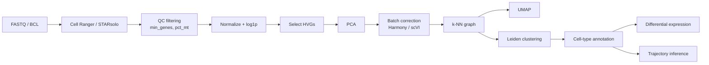

# Chapter 9 — Cellular Systems & Single-Cell Intelligence

> *"Bulk RNA-seq tells us what a tissue is on average; single-cell tells us who lives there."*

## Learning objectives

- Walk through an end-to-end single-cell analysis: QC, normalization, embedding, clustering, annotation, differential expression, trajectory.
- Compare the four leading foundation models for single cells: scVI, scGPT, Geneformer, scFoundation.
- Quantify and remove batch effects using both classical (Harmony) and deep (scVI) methods.
- Critically evaluate cell-type annotation produced by an LLM-style model.

## 9.1  The canonical pipeline



## 9.2  Foundation models for single cells

| Model | Backbone | Training corpus | Strengths |
|-------|----------|------------------|-----------|
| scVI | VAE | Per-study | Probabilistic; integrates batches; lightweight |
| scGPT | Transformer | 33 M cells | Zero-shot annotation; perturbation prediction |
| Geneformer | BERT | 30 M cells | Gene-network reasoning; in-silico KOs |
| scFoundation | Transformer + read-depth encoder | 50 M cells | Robust across depths |

## 9.3  Worked example — PBMC 3 k with scVI

```python
import scanpy as sc
import scvi

adata = sc.read_h5ad("data/silver/pbmc3k.h5ad")
scvi.model.SCVI.setup_anndata(adata, batch_key="sample")
model = scvi.model.SCVI(adata, n_latent=10, n_layers=2)
model.train(max_epochs=100, early_stopping=True)
adata.obsm["X_scvi"] = model.get_latent_representation()
sc.pp.neighbors(adata, use_rep="X_scvi")
sc.tl.umap(adata)
sc.tl.leiden(adata, resolution=0.5)
```

`X_scvi` is a denoised, batch-corrected 10-D embedding suitable for downstream tasks.

## 9.4  Annotation strategies, ranked

1. **Reference mapping** (e.g. `scArches`, `Symphony`) — best when a high-quality atlas exists.
2. **Marker-based** (`scanpy.tl.rank_genes_groups`) — interpretable but brittle to dropout.
3. **Foundation model zero-shot** (scGPT, scimilarity) — convenient but check confusion with rare types.
4. **Manual + expert** — still required for novel tissues.

A defensible workflow uses (1)+(3) for an initial guess and (2)+(4) to validate.

## 9.5  Trajectory and dynamics

For continuous biology (differentiation, immune activation):

- `scvelo` (steady-state and dynamical) gives RNA velocity.
- `palantir`, `cellrank` build fate-probability maps from a Markov chain on the k-NN graph.
- `dynamo` lifts to a continuous vector field — usable with the neural ODE recipes from Chapter 6.

Always sanity-check velocities at boundaries (terminal cell types should be sinks).

## 9.6  Common pitfalls

- **Ambient RNA.** Use `SoupX`, `CellBender`, or `DecontX`. Otherwise you will discover "T-cell receptor" in macrophages.
- **Doublet contamination.** Run `Scrublet` or `DoubletFinder`; check that your "rare" cluster is not just doublets of two common types.
- **Over-clustering.** Statistical significance of marker genes is not the same as biological reality. Tie clusters to spatial / functional evidence whenever possible.
- **Annotation by LLM hallucination.** Foundation-model labels look plausible because they parrot training-set names. Always provide a reference atlas to ground the prediction.

## 9.7  Exercises

1. **Atlas integration.** Integrate three public PBMC datasets with `scVI`. Quantify mixing with `kBET` and biological conservation with `ARI` against the manual labels.
2. **Foundation-model probe.** Fine-tune scGPT for a 6-way myeloid sub-type classifier. Compare to a Random Forest baseline on PCA features.
3. **Velocity vs. perturbation.** Use scVelo on a CRISPRi time-course dataset. Do the predicted future states match the experimentally measured states 24 h later?
4. **Ambient cleanup.** Re-run your PBMC3k pipeline with and without `CellBender`. Report changes in cluster counts and marker-gene specificity.

## 9.8  Further reading

- Wolf, F. A. *SCANPY: large-scale single-cell gene expression data analysis.* Genome Biol. (2018).
- Lopez, R. *Deep generative modeling for single-cell transcriptomics.* Nat. Methods (2018) — scVI.
- Theodoris, C. *Transfer learning enables predictions in network biology.* Nature (2023) — Geneformer.
- Cui, H. *scGPT.* Nat. Methods (2024).

## See also

- [Chapter 5 — Representation Learning](chapter_05_embeddings.md)
- [Single-Cell API](../api/single_cell.md)
- [Chapter 10 — Development & Morphogenesis](chapter_10_development.md)
