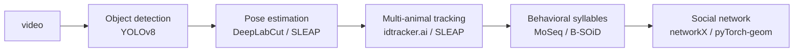

# Chapter 12 — Behavior, Ethology & Social Systems

> *"Behavior is the highest-bandwidth biological measurement we have."*

## Learning objectives

- Use modern pose-estimation tools (DeepLabCut, SLEAP, AnyMAL) to extract markerless animal pose from video.
- Cluster behavioral time series into "syllables" with unsupervised methods (MoSeq, B-SOiD, Keypoint-MoSeq).
- Apply graph models to social network data (interactions over time) and detect emergent collective behavior.
- Recognize ethical considerations specific to non-human animal observation.

## 12.1  From pixels to pose



Each step has a dominant tool today. Inserting a foundation pose model (e.g. ViTPose-NHP for non-human primates) typically halves the labeling burden.

## 12.2  Behavioral syllables

`Keypoint-MoSeq` (Wiltschko, Pereira et al.) fits a Gaussian-AR-HMM to keypoint time series and discovers ~30–80 distinct stereotyped motifs (syllables) per species. Each syllable has:

- A typical duration (~200–400 ms).
- A characteristic trajectory in pose space.
- A transition probability into other syllables.

These syllables provide a *vocabulary* for higher-level behavioral analyses (effect of drugs, optogenetic stimulation, genotype).

## 12.3  Worked example — pose → embedding → cluster

```python
import numpy as np
from sklearn.preprocessing import StandardScaler
from sklearn.decomposition import PCA
import umap

# pose: (T, K, 2) — T frames, K keypoints, x/y
def behavior_embedding(pose: np.ndarray) -> np.ndarray:
    feats = []
    for t in range(2, len(pose)):
        v = pose[t] - pose[t - 1]          # velocity
        a = v - (pose[t - 1] - pose[t - 2]) # acceleration
        feats.append(np.concatenate([pose[t].flatten(), v.flatten(), a.flatten()]))
    X = StandardScaler().fit_transform(np.array(feats))
    return umap.UMAP(n_neighbors=30, min_dist=0.1).fit_transform(PCA(20).fit_transform(X))
```

Cluster `behavior_embedding(pose)` with HDBSCAN; play exemplar video clips per cluster to interpret.

## 12.4  Social-network analysis

Treat each animal as a node, each proximity / interaction event as an edge with a timestamp. Useful primitives:

- **Centrality** (degree, eigenvector, betweenness) for individuals.
- **Modularity** to detect groups.
- **Temporal motifs** (e.g. AB → BC → CA triangles within `Δt`) — predictive of information transfer.

Graph-neural networks then predict outcomes such as disease spread, fight initiation, or rank changes.

## 12.5  Collective behavior

Schools, flocks, and swarms are exquisite testbeds for *interpretable* deep learning. A common protocol:

1. Track all individuals' velocity vectors.
2. Fit a Vicsek-like model with neural force terms.
3. Compare with the symbolic mechanistic baseline; the *residual* is the learnable part.

## 12.6  Ethical considerations

- **Welfare.** Marker-less methods reduce surgical intervention; document IACUC / ethics approval.
- **Surveillance creep.** The same tools can be applied to humans; treat publication of identifiable animal IDs with care.
- **Wildlife disturbance.** Drone-mounted observation has measurable physiological cost for many species; use camera traps when possible.

## 12.7  Exercises

1. **DLC vs. SLEAP.** Annotate 200 frames of mouse video. Train DeepLabCut and SLEAP; compare keypoint RMSE on held-out frames.
2. **Syllable replication.** Apply Keypoint-MoSeq to a published open-field dataset. Reproduce the syllable count and average duration reported by the original authors within ± 20 %.
3. **Social GNN.** On the SOCIAL-Mice dataset, train a GNN to predict the dominance rank of an individual from one week of interactions.
4. **Welfare audit.** For the animal videos you used above, write a short welfare statement covering housing, IACUC protocol, and de-identification.

## 12.8  Further reading

- Mathis, A. *DeepLabCut.* Nat Neurosci (2018).
- Pereira, T. *SLEAP.* Nat. Methods (2022).
- Wiltschko, A. *Mapping sub-second structure in mouse behavior.* Neuron (2015) — MoSeq.
- Tuia, D. *Perspectives in machine learning for wildlife conservation.* Nat Commun (2022).

## See also

- [Chapter 11 — Neuroscience](chapter_11_neuroscience.md)
- [Chapter 14 — Ecology & Conservation](chapter_14_ecology.md)
- [Chapter 19 — Ethics of AI in Biology](chapter_19_ethics.md)
