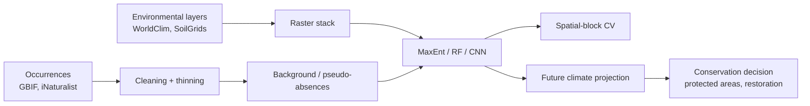

# Chapter 14 — Ecology & Conservation

> *"In ecology, the model is wrong if it cannot guide a decision under uncertainty."*

## Learning objectives

- Build a species distribution model (SDM) end-to-end using GBIF occurrences and WorldClim covariates.
- Detect biodiversity from eDNA, camera traps, and acoustics with state-of-the-art classifiers.
- Identify and validate *early-warning signals* for ecological tipping points.
- Translate model outputs into actionable conservation recommendations.

## 14.1  The SDM workflow



Always validate with **spatial block CV** — random CV grossly overestimates SDM accuracy.

### 14.1a  The SDM workflow — spatial block cross-validation in practice

The workflow above mentions spatial block CV but does not show an implementation. Below is a **complete example** using `sklearn` and `blockCV` to ensure honest evaluation.

**Why spatial block CV is essential.** Ecological data are spatially autocorrelated. Random cross-validation overestimates performance because nearby points (which are similar) end up in both training and test sets. Spatial blocking holds out entire spatial regions.

```python
import numpy as np
import pandas as pd
from sklearn.ensemble import RandomForestClassifier
from sklearn.metrics import roc_auc_score
from blockCV import cv_spatial

# Assume:
# X:      (n_presence + n_background, p) environmental covariates
# y:      (n_samples,) 0/1 presence
# coords: (n_samples, 2) longitude/latitude

# Create spatial blocks (e.g. 50 km x 50 km)
spatial_blocks = cv_spatial(
    x=coords,
    species=df["species"],
    size=50000,        # block size in meters (50 km)
    k=5,               # 5 folds
    selection="random",
    iteration=1,
)

aucs = []
for fold in range(5):
    train_idx = spatial_blocks["folds"][fold]["train"]
    test_idx = spatial_blocks["folds"][fold]["test"]
    clf = RandomForestClassifier(n_estimators=500, class_weight="balanced")
    clf.fit(X[train_idx], y[train_idx])
    y_pred = clf.predict_proba(X[test_idx])[:, 1]
    aucs.append(roc_auc_score(y[test_idx], y_pred))

print(f"Spatial block AUC: {np.mean(aucs):.3f} ± {np.std(aucs):.3f}")
```

Compare to random CV on the same data:

```python
from sklearn.model_selection import KFold

random_cv = KFold(n_splits=5, shuffle=True)
aucs_random = []
for train_idx, test_idx in random_cv.split(X):
    clf = RandomForestClassifier(n_estimators=500, class_weight="balanced")
    clf.fit(X[train_idx], y[train_idx])
    y_pred = clf.predict_proba(X[test_idx])[:, 1]
    aucs_random.append(roc_auc_score(y[test_idx], y_pred))

print(f"Random CV AUC: {np.mean(aucs_random):.3f} ± {np.std(aucs_random):.3f}")
```

**Expected result.** Spatial block AUC is typically 0.05–0.15 lower than random CV AUC. A gap larger than 0.2 indicates the model is severely overfitting to spatial autocorrelation.

**Pitfall.** Choosing the block size is arbitrary. Test multiple sizes (e.g. 25 km, 50 km, 100 km) and report the range of AUCs. For species with small ranges, use buffering rather than blocks.

## 14.2  Detection at scale

| Modality | Classifier | Notes |
|----------|-----------|-------|
| Camera-trap images | MegaDetector + classifier head | Two-stage detector → species; works with <100 labels for fine-tune. |
| Audio (birds, bats) | BirdNET, Perch | Embed clips; nearest-neighbor in embedding space rivals supervised. |
| Insect images | InsectNet, AMI traps | Domain shift across continents is the dominant error. |
| eDNA metabarcoding | DADA2 + LCA | Beware primer bias; sequence-only ID ≠ species. |
| Satellite | Segment Anything + Sentinel-2 | Patch-based classification of habitat types. |

### 14.2a  Detection at scale — ensemble methods for camera traps

Different detectors carry different biases: MegaDetector (tuned for animals) may misclassify birds, while a species classifier may miss rare taxa. An **ensemble** with weighted voting can leverage their complementary strengths.

**Ensemble workflow for camera-trap images:**

1. **Run multiple detectors** on each image:
   - MegaDetector v5: bounding boxes + class (animal, human, vehicle, empty).
   - A species-specific classifier (e.g. ResNet trained on iNaturalist) for image data — BirdNET applies only to audio.
   - A lightweight model (e.g. EfficientNet) fine-tuned on your specific camera-trap dataset, if available.
2. **Align predictions** across models. For each bounding box, compute the Intersection over Union (IoU) with boxes from other models and group boxes with IoU > 0.5.
3. **Weighted vote** per group: weight each model's confidence by its validation accuracy (e.g. F1) on a held-out set.

```python
def ensemble_predictions(detections, model_weights):
    """
    detections: list of dicts from each model, each with 'bbox', 'class',
                'confidence', and 'model'.
    model_weights: dict mapping model_name -> weight (e.g. validation F1).
    Returns list of merged predictions.
    """
    merged = []
    used = set()
    for i, det_i in enumerate(detections[0]):  # use first model as reference
        if i in used:
            continue
        group = [det_i]
        used.add(i)
        for j, det_j in enumerate(detections[0][i + 1:], start=i + 1):
            if j in used:
                continue
            iou = compute_iou(det_i["bbox"], det_j["bbox"])
            if iou > 0.5:
                group.append(det_j)
                used.add(j)
        # Weighted vote for class
        votes = {}
        for det in group:
            weight = model_weights.get(det["model"], 1.0)
            votes[det["class"]] = votes.get(det["class"], 0) + weight * det["confidence"]
        best_class = max(votes, key=votes.get)
        best_conf = max(det["confidence"] for det in group)
        merged.append({"bbox": det_i["bbox"], "class": best_class, "confidence": best_conf})
    return merged
```

**Pitfall.** Ensembles increase computational cost (all models must run). For on-device edge deployment use a single efficient model; for batch analysis on a server, an ensemble is feasible.

## 14.3  Worked example — SDM with random forest

```python
import numpy as np
from sklearn.ensemble import RandomForestClassifier
from sklearn.model_selection import GroupKFold

# X: (n, p) covariates at presence + background points
# y: (n,) 0/1 presence
# group: (n,) spatial block id

cv = GroupKFold(n_splits=5)
aucs = []
for tr, te in cv.split(X, y, groups=group):
    m = RandomForestClassifier(n_estimators=500, class_weight="balanced", n_jobs=-1)
    m.fit(X[tr], y[tr])
    p = m.predict_proba(X[te])[:, 1]
    aucs.append(roc_auc_score(y[te], p))
print(f"Spatial-block AUC = {np.mean(aucs):.3f} ± {np.std(aucs):.3f}")
```

A *responsible* report includes calibration, partial-dependence plots, and an honest discussion of sampling bias.

### 14.3a  Worked example extension — calibration and partial dependence

**Why calibration?** Random-forest probabilities are often overconfident (predicted values cluster near 0 or 1). Calibration maps them back to true observed frequencies.

```python
from sklearn.calibration import CalibratedClassifierCV

clf = RandomForestClassifier(n_estimators=500, class_weight="balanced")
clf.fit(X_train, y_train)

# Calibrate using Platt scaling (sigmoid) or isotonic regression
calibrated_clf = CalibratedClassifierCV(clf, method="sigmoid", cv=5)
calibrated_clf.fit(X_train, y_train)

from sklearn.calibration import calibration_curve
import matplotlib.pyplot as plt

y_prob_uncal = clf.predict_proba(X_test)[:, 1]
y_prob_cal = calibrated_clf.predict_proba(X_test)[:, 1]

frac_uncal, mean_uncal = calibration_curve(y_test, y_prob_uncal, n_bins=10)
frac_cal, mean_cal = calibration_curve(y_test, y_prob_cal, n_bins=10)

plt.plot(mean_uncal, frac_uncal, label="Uncalibrated", marker="o")
plt.plot(mean_cal, frac_cal, label="Calibrated", marker="s")
plt.plot([0, 1], [0, 1], "k--", label="Perfect calibration")
plt.xlabel("Mean predicted probability")
plt.ylabel("Fraction of positives")
plt.legend()
```

**Partial-dependence plots (PDP)** show the marginal effect of each environmental variable on predicted suitability:

```python
from sklearn.inspection import partial_dependence

# Marginal effect of a single variable (e.g. annual temperature)
pdp = partial_dependence(clf, X_train, features=[0], kind="average", grid_resolution=50)
plt.plot(pdp["values"][0], pdp["average"][0])
plt.xlabel("Annual mean temperature (°C)")
plt.ylabel("Partial dependence (log odds)")
plt.title("Effect of temperature on habitat suitability")
```

**Pitfall.** PDPs assume no strong interactions. For interacting variables (e.g. temperature × precipitation), use **individual conditional expectation (ICE)** plots instead.

## 14.4  Early-warning signals

Approaching a tipping point (e.g. lake eutrophication, coral collapse), generic statistical signatures appear:

- **Rising autocorrelation** of a state variable.
- **Rising variance** (critical slowing down).
- **Skewness shifts** depending on the bifurcation type.

`earlywarnings` (Dakos et al.) implements the classical tests; deep models such as `EWSNet` (Bury et al., 2021) achieve higher sensitivity and have demonstrated cross-system transferability.

### 14.4a  Early-warning signals — critical slowing down indicators

**Critical slowing down theory.** As a system approaches a bifurcation, recovery rates slow down, manifesting as increased lag-1 autocorrelation, increased variance, and (for some bifurcations) shifts in skewness. Compute these indicators on a rolling window:

```python
import numpy as np
import pandas as pd

def early_warning_indicators(time_series, window=50, step=5):
    """
    Compute autocorrelation, variance, and skewness in rolling windows.
    Returns a DataFrame with one row of indicators per window.
    """
    n = len(time_series)
    windows = []
    for start in range(0, n - window, step):
        end = start + window
        segment = time_series[start:end]
        acf = np.corrcoef(segment[:-1], segment[1:])[0, 1]  # lag-1 autocorrelation
        var = np.var(segment)
        skew = pd.Series(segment).skew()
        windows.append({
            "time_center": (start + end) / 2,
            "autocorrelation": acf,
            "variance": var,
            "skewness": skew,
        })
    return pd.DataFrame(windows)

# Simulate a system approaching a tipping point
# (logistic map with slowly increasing r)
def logistic_tipping_point(n=500, r_start=2.5, r_end=3.6):
    x = np.zeros(n)
    x[0] = 0.5
    r = np.linspace(r_start, r_end, n)
    for t in range(1, n):
        x[t] = r[t] * x[t - 1] * (1 - x[t - 1])
    return x

x = logistic_tipping_point()
indicators = early_warning_indicators(x, window=50)

import matplotlib.pyplot as plt
fig, axes = plt.subplots(4, 1, sharex=True)
axes[0].plot(x)
axes[0].set_ylabel("State variable")
axes[1].plot(indicators["time_center"], indicators["autocorrelation"])
axes[1].set_ylabel("Lag-1 AC")
axes[2].plot(indicators["time_center"], indicators["variance"])
axes[2].set_ylabel("Variance")
axes[3].plot(indicators["time_center"], indicators["skewness"])
axes[3].set_ylabel("Skewness")
axes[3].set_xlabel("Time")
```

**Expected pattern.** All indicators rise sharply before the bifurcation (around t≈400 where r≈3.57, the onset of chaos).

**Pitfall.** These indicators also rise with non-stationarity (e.g. seasonal cycles). Always detrend the series first using a low-pass filter or differencing.

## 14.5  Conservation decision support

Outputs must be *decision-grade*:

- Probabilistic, not point estimates.
- Spatially explicit, with uncertainty maps.
- Documented assumptions (climate scenario, dispersal model).
- Reviewable by domain experts and stakeholders.

Decision tools (`prioritizr`, `Marxan`, `Zonation`) consume SDM rasters and propose reserve designs under budget and connectivity constraints.

### 14.5a  Conservation decision support — a prioritizr-style planning example

**Goal.** Select protected areas that maximize species coverage subject to a budget constraint (e.g. 17 % of land area, the Aichi target).

**Inputs:**

- A raster of planning units (grid cells).
- For each species, a binary presence/absence map (or continuous suitability score).
- A cost per unit (e.g. land acquisition or opportunity cost).

The `prioritizr` R package is the production tool; here is a simplified linear-programming formulation with `pulp` that conveys the core idea.

```python
import pulp
import numpy as np

def conservation_planning(species_rasters, costs, budget_fraction=0.17):
    """
    species_rasters: array-like (n_species, n_cells) of suitability scores.
    costs:           1D array of cost per cell.
    budget_fraction: fraction of total cost allowed.
    """
    n_cells = len(costs)
    n_species = len(species_rasters)
    budget = budget_fraction * np.sum(costs)

    prob = pulp.LpProblem("ConservationPlanning", pulp.LpMaximize)
    x = [pulp.LpVariable(f"x_{i}", cat="Binary") for i in range(n_cells)]

    # For each species, y_s indicates whether it is covered by a selected cell.
    species_vars = []
    for s in range(n_species):
        y_s = pulp.LpVariable(f"y_{s}", cat="Binary")
        species_vars.append(y_s)
        # y_s can be 1 only if at least one cell where species s is present is selected
        prob += y_s <= pulp.lpSum(
            x[i] for i in range(n_cells) if species_rasters[s][i] > 0.5
        )

    prob += pulp.lpSum(species_vars)  # maximize number of species covered

    # Budget constraint
    prob += pulp.lpSum(costs[i] * x[i] for i in range(n_cells)) <= budget

    prob.solve(pulp.PULP_CBC_CMD(msg=False))
    selected = [i for i in range(n_cells) if x[i].varValue > 0.5]
    return selected, [v.varValue for v in species_vars]
```

**Output.** A set of planning units to protect, which you can visualize on a map.

**Pitfall.** This is a simplified version; real conservation planning requires connectivity constraints, multiple zones (strict vs. multiple-use), and uncertainty in species distributions. Use `prioritizr` for production work.

## 14.6  Pitfalls

- **Sampling bias.** GBIF density correlates with road density. Down-weight or use target-group background.
- **Transfer across climate space.** A model fit in today's climate will extrapolate; report fraction of projection points outside training envelope.
- **Class imbalance in camera traps.** 99 % "empty"; a naive accuracy of 99 % learns nothing.
- **Ethical disclosure.** Locations of endangered species require obfuscation.

### 14.6a  Extended pitfalls — sampling bias and ethical disclosure

**Quantifying sampling bias.** Compute the correlation between GBIF occurrence density and human footprint (population or road density). A Spearman ρ > 0.5 indicates heavily biased data; mitigate with **target-group background** (sample background points from the same taxonomic group's occurrence density).

```python
def sampling_bias_correlation(gbif_density, human_pop_density):
    """Spearman correlation between occurrence density and human footprint."""
    from scipy.stats import spearmanr
    rho, p = spearmanr(gbif_density, human_pop_density)
    print(f"Spearman rho = {rho:.3f}, p = {p:.3e}")
    return rho
```

**Ethical disclosure for endangered species.**

- For species at high poaching risk (rhinoceros, pangolin, orchids), **obfuscate** precise coordinates to 10 km or coarser in public datasets.
- Never publish maps showing exact predicted locations of known dens or nests.
- Apply **spatial blurring** (a Gaussian kernel with σ ≈ 5–10 km) to prediction rasters before sharing.

**Pitfall.** Even blurred coordinates can be reverse-engineered when combined with other data. Consult conservation practitioners before any public release.

## 14.7  Exercises

1. **End-to-end SDM.** Pick a species in your region. Pull GBIF + WorldClim. Fit a random-forest SDM with spatial block CV. Project to 2050 under SSP3-7.0.
2. **Audio biodiversity.** Use BirdNET on 10 minutes of a public soundscape recording. Compare predicted species list with the metadata.
3. **Early warning.** Add noise + slow drift to a stylized harvested-population model; reproduce the rising-variance signal as you approach the bifurcation.
4. **Decision design.** Feed your SDM raster into `prioritizr`; design a reserve that maximizes species coverage subject to 17 % area protection.
5. **Spatial block CV comparison.** Download a real species occurrence dataset (e.g. a common bird from GBIF). Extract WorldClim covariates. Compare spatial block AUC (50 km blocks) to random AUC and to a spatial-thinned AUC (randomly removing points to reduce autocorrelation). Which method gives the most realistic estimate of out-of-sample performance?
6. **Ensemble for camera traps.** Using the public Caltech Camera Traps dataset, train two models (e.g. MegaDetector + a custom ResNet) and combine them with weighted voting. How much does accuracy improve over the best single model? Which classes benefit most (rare vs. common)?
7. **Early warning in real data.** Find a real ecological time series known to have experienced a regime shift (e.g. lake eutrophication data from GLEON). Compute early-warning indicators and test whether they showed detectable trends before the shift. What is the false-positive rate on control lakes that did not shift?
8. **Conservation planning under uncertainty.** Generate three alternative SDM predictions for the same set of species (e.g. using different climate models) and run `prioritizr` on each. Compute the robustness of the selected reserve: what fraction of selected cells appear in all three plans? This is the *irreplaceability* map.

## 14.8  Further reading

- Elith, J. *Novel methods improve prediction of species' distributions from occurrence data.* Ecography (2006).
- Tuia, D. *Perspectives in machine learning for wildlife conservation.* Nat Commun (2022).
- Dakos, V. *Methods for detecting early warnings of critical transitions.* PLOS One (2012).
- Beery, S. *The iWildCam challenges.* (2018–2023).
- Valavi, R. *Predictive performance of presence-only species distribution models: a benchmark study with reproducible code.* Ecological Monographs (2022).
- Beery, S. *The iWildCam 2020 challenge: a vision for monitoring wildlife.* arXiv (2020).
- Dakos, V. *Early warning signals of ecological tipping points.* Nature Ecology & Evolution (2015).
- Hanson, J. O. *prioritizr: a R package for systematic conservation prioritization.* Journal of Open Source Software (2022).

## See also

- [Chapter 12 — Behavior & Social Systems](chapter_12_ethology.md)
- [Chapter 15 — Earth Systems & Planetary Biology](chapter_15_earth.md)
- [Ecology API](../api/ecology.md)


---
<sub>Support DaScient, Inc. (a non-profit promoting accessible intelligence and community learning) via [Donations](https://cash.app/dascient/).</sub>
