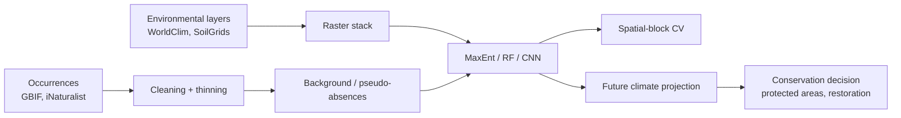

# Chapter 14 — Ecology & Conservation

> *"In ecology, the model is wrong if it cannot guide a decision under uncertainty."*

## Learning objectives

- Build a species distribution model (SDM) end-to-end using GBIF occurrences and WorldClim covariates.
- Detect biodiversity from eDNA, camera traps, and acoustics with state-of-the-art classifiers.
- Identify and validate *early-warning signals* for ecological tipping points.
- Translate model outputs into actionable conservation recommendations.

## 14.1  The SDM workflow



Always validate with **spatial block CV** — random CV grossly overestimates SDM accuracy.

## 14.2  Detection at scale

| Modality | Classifier | Notes |
|----------|-----------|-------|
| Camera-trap images | MegaDetector + classifier head | Two-stage detector → species; works with <100 labels for fine-tune. |
| Audio (birds, bats) | BirdNET, Perch | Embed clips; nearest-neighbor in embedding space rivals supervised. |
| Insect images | InsectNet, AMI traps | Domain shift across continents is the dominant error. |
| eDNA metabarcoding | DADA2 + LCA | Beware primer bias; sequence-only ID ≠ species. |
| Satellite | Segment Anything + Sentinel-2 | Patch-based classification of habitat types. |

## 14.3  Worked example — SDM with random forest

```python
import numpy as np
from sklearn.ensemble import RandomForestClassifier
from sklearn.model_selection import GroupKFold

# X: (n, p) covariates at presence + background points
# y: (n,) 0/1 presence
# group: (n,) spatial block id

cv = GroupKFold(n_splits=5)
aucs = []
for tr, te in cv.split(X, y, groups=group):
    m = RandomForestClassifier(n_estimators=500, class_weight="balanced", n_jobs=-1)
    m.fit(X[tr], y[tr])
    p = m.predict_proba(X[te])[:, 1]
    aucs.append(roc_auc_score(y[te], p))
print(f"Spatial-block AUC = {np.mean(aucs):.3f} ± {np.std(aucs):.3f}")
```

A *responsible* report includes calibration, partial-dependence plots, and an honest discussion of sampling bias.

## 14.4  Early-warning signals

Approaching a tipping point (e.g. lake eutrophication, coral collapse), generic statistical signatures appear:

- **Rising autocorrelation** of a state variable.
- **Rising variance** (critical slowing down).
- **Skewness shifts** depending on the bifurcation type.

`earlywarnings` (Dakos et al.) implements the classical tests; deep models such as `EWSNet` (Bury et al., 2021) achieve higher sensitivity and have demonstrated cross-system transferability.

## 14.5  Conservation decision support

Outputs must be *decision-grade*:

- Probabilistic, not point estimates.
- Spatially explicit, with uncertainty maps.
- Documented assumptions (climate scenario, dispersal model).
- Reviewable by domain experts and stakeholders.

Decision tools (`prioritizr`, `Marxan`, `Zonation`) consume SDM rasters and propose reserve designs under budget and connectivity constraints.

## 14.6  Pitfalls

- **Sampling bias.** GBIF density correlates with road density. Down-weight or use target-group background.
- **Transfer across climate space.** A model fit in today's climate will extrapolate; report fraction of projection points outside training envelope.
- **Class imbalance in camera traps.** 99 % "empty"; a naive accuracy of 99 % learns nothing.
- **Ethical disclosure.** Locations of endangered species require obfuscation.

## 14.7  Exercises

1. **End-to-end SDM.** Pick a species in your region. Pull GBIF + WorldClim. Fit a random-forest SDM with spatial block CV. Project to 2050 under SSP3-7.0.
2. **Audio biodiversity.** Use BirdNET on 10 minutes of a public soundscape recording. Compare predicted species list with the metadata.
3. **Early warning.** Add noise + slow drift to a stylized harvested-population model; reproduce the rising-variance signal as you approach the bifurcation.
4. **Decision design.** Feed your SDM raster into `prioritizr`; design a reserve that maximizes species coverage subject to 17 % area protection.

## 14.8  Further reading

- Elith, J. *Novel methods improve prediction of species' distributions from occurrence data.* Ecography (2006).
- Tuia, D. *Perspectives in machine learning for wildlife conservation.* Nat Commun (2022).
- Dakos, V. *Methods for detecting early warnings of critical transitions.* PLOS One (2012).
- Beery, S. *The iWildCam challenges.* (2018–2023).

## See also

- [Chapter 12 — Behavior & Social Systems](chapter_12_ethology.md)
- [Chapter 15 — Earth Systems & Planetary Biology](chapter_15_earth.md)
- [Ecology API](../api/ecology.md)
