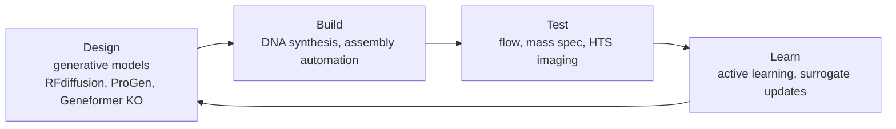

# Chapter 17 — Biotechnology & Bioengineering

> *"Engineering biology is increasingly an information-design problem; AI is the IDE."*

## Learning objectives

- Map the biotech design–build–test–learn (DBTL) cycle to ML primitives.
- Apply generative models to enzyme, antibody, and genetic-circuit design.
- Use active learning to minimize wet-lab cost.
- Address dual-use and biosafety implications explicitly.

## 17.1  The DBTL cycle, with AI at every stage



The empirical claim: a single closed DBTL loop with active learning typically reaches a target metric in 3–10× fewer rounds than open-loop screening.

### 17.1a  The DBTL cycle — quantitative metrics for each stage

The diagram above shows Design–Build–Test–Learn. Adding **typical metrics and bottlenecks** at each stage helps identify where AI has the greatest impact.

| Stage | Typical throughput (lab scale) | Bottleneck | AI intervention | Success metric |
|-------|-------------------------------|------------|----------------|----------------|
| **Design** | 10⁶–10¹⁰ sequences (in silico) | Diversity vs. feasibility trade-off | Generative models (ProGen, RFdiffusion) | Number of high-confidence designs per hour |
| **Build** | 10³–10⁴ variants per run (DNA synthesis) | Synthesis cost, assembly accuracy | Codon optimization, error-prone PCR simulation | Cost per base pair, turnaround time |
| **Test** | 10²–10⁴ variants per day (FACS, MS) | Assay multiplexing, dynamic range | Active learning to prioritize high-value tests | Number of assays per dollar, signal-to-noise ratio |
| **Learn** | Human-days to weeks | Data integration across rounds | Surrogate model (GP, PLM head) | Prediction accuracy on held-out variants |

**Rule of thumb:** If your Design stage generates more variants than your Test stage can handle, use active learning to subsample. If your Test stage is the bottleneck, invest in higher-throughput assays (e.g., next-generation sequencing readout) before adding AI complexity.

**Pitfall:** Many ML-guided engineering projects fail because they optimize design without considering build/test constraints. For example, a designed protein with a rare codon may be impossible to express in your host.

## 17.2  Enzyme engineering

A high-yield recipe:

1. Train (or fine-tune) a PLM on the family of interest.
2. Score the wild-type sequence with zero-shot LLR (Chapter 8).
3. Generate variants conditioned on activity priors (UCB, conservative ESM-IF).
4. Express, purify, assay.
5. Update the surrogate; iterate.

OpenProtein, ProGen, and EvoBind have demonstrated 10–100× activity gains in 2–3 rounds for esterases, glycosyltransferases, and de novo binders.

### 17.2a  Enzyme engineering — a complete active learning workflow with real data

The recipe above can be made concrete with a **hands-on implementation** on a published dataset. We use the ProteinGym `BLAT_ECOLX` (β-lactamase) landscape, which contains fitness values for thousands of single and double mutants, and simulate an MLDE campaign.

1. **Initial library design.** Sample 96 random single mutants (without replacement).
2. **Surrogate model.** ESM-2 embeddings + Gaussian process with a Matérn kernel.
3. **Acquisition function.** Upper confidence bound (UCB) with β decay over rounds.
4. **Iterate.** For 3 rounds, each round selects 96 new variants based on UCB.

```python
import numpy as np
import matplotlib.pyplot as plt
from sklearn.gaussian_process import GaussianProcessRegressor
from sklearn.gaussian_process.kernels import Matern, WhiteKernel
from sklearn.preprocessing import StandardScaler
from transformers import AutoTokenizer, AutoModel
import torch

# 1. Load the fitness landscape (simulated oracle)
# Assume we have a dictionary: mutant_seq -> fitness
oracle = load_proteingym_landscape('BLAT_ECOLX')

# 2. Pre-compute ESM-2 embeddings for all possible single mutants
model_name = "facebook/esm2_t12_35M_UR50D"
tokenizer = AutoTokenizer.from_pretrained(model_name)
esm = AutoModel.from_pretrained(model_name)

def get_embedding(seq):
    inputs = tokenizer(seq, return_tensors="pt")
    with torch.no_grad():
        outputs = esm(**inputs)
    # mean pool over residues (excluding special tokens)
    return outputs.last_hidden_state[0, 1:-1, :].mean(0).numpy()

wt_seq = "MKTIIALSYIFCLVFA..."  # placeholder wild-type sequence
L = len(wt_seq)
mutations, embeddings = [], []
for pos in range(L):
    for aa in 'ACDEFGHIKLMNPQRSTVWY':
        if aa == wt_seq[pos]:
            continue
        mut_seq = wt_seq[:pos] + aa + wt_seq[pos + 1:]
        mutations.append(mut_seq)
        embeddings.append(get_embedding(mut_seq))

embeddings = np.array(embeddings)
scaler = StandardScaler()
embeddings_scaled = scaler.fit_transform(embeddings)

# 3. Active learning loop
n_initial, n_rounds, batch_size = 96, 3, 96
idx_initial = np.random.choice(len(mutations), n_initial, replace=False)
X_train = embeddings_scaled[idx_initial]
y_train = np.array([oracle(mutations[i]) for i in idx_initial])
remaining_idx = list(set(range(len(mutations))) - set(idx_initial))

def ucb_acquisition(gp, X_candidate, beta):
    mu, sigma = gp.predict(X_candidate, return_std=True)
    return mu + beta * sigma

best_fitness_history = [y_train.max()]
beta0, beta_decay = 2.0, 0.8

for rnd in range(n_rounds):
    kernel = Matern(nu=2.5, length_scale=1.0) + WhiteKernel(noise_level=0.1)
    gp = GaussianProcessRegressor(kernel=kernel, n_restarts_optimizer=5)
    gp.fit(X_train, y_train)

    X_candidate = embeddings_scaled[remaining_idx]
    beta = beta0 * (beta_decay ** rnd)
    scores = ucb_acquisition(gp, X_candidate, beta)

    top_in_candidate = np.argsort(scores)[-batch_size:]
    selected_idx = [remaining_idx[i] for i in top_in_candidate]
    new_y = np.array([oracle(mutations[i]) for i in selected_idx])

    X_train = np.vstack([X_train, embeddings_scaled[selected_idx]])
    y_train = np.concatenate([y_train, new_y])
    remaining_idx = list(set(remaining_idx) - set(selected_idx))

    best_fitness_history.append(y_train.max())
    print(f"Round {rnd + 1}: best fitness = {y_train.max():.4f}")

# Compare to a random sampling baseline
random_best = []
for _ in range(10):
    idx_random = np.random.choice(
        len(mutations), n_initial + n_rounds * batch_size, replace=False)
    random_fitness = [oracle(mutations[i]) for i in idx_random]
    random_best.append(np.maximum.accumulate(random_fitness))
random_best_mean = np.mean(random_best, axis=0)

plt.plot(best_fitness_history, label='UCB active learning')
plt.plot(random_best_mean, label='Random sampling', linestyle='--')
plt.xlabel('Round (cumulative variants)')
plt.ylabel('Best fitness')
plt.legend()
```

**Expected outcome:** UCB reaches near-maximal fitness (e.g., 90% of the global maximum) after 2–3 rounds (≈ 300 variants), while random sampling requires > 1000 variants.

**Pitfall:** The GP's kernel length scale must be tuned. Too short → overfits to local structure; too long → assumes smoothness that may not hold.

## 17.3  Antibody design

The current state of the art:

- **Sequence-only**: AbLang2, IgLM, AbDiffuser propose CDR variants from training distributions of OAS / SAbDab.
- **Structure-aware**: RFdiffusion + IgFold for antibody:antigen interfaces.
- **Functional triage**: ESM-IF + RoseTTAFold-2 for binding pose scoring.

Hit rates for in-silico designed binders are climbing past 10 %, with sub-nM affinities reported.

### 17.3a  Antibody design — structural fine-tuning with IgFold

Beyond IgLM and RFdiffusion, IgFold provides an inverse-folding model for antibodies that can design complementarity-determining region (CDR) sequences given a backbone structure.

**Use case:** You have an antibody variable domain backbone (from homology modeling or crystal structure) and want to design CDR loops with high affinity to a target antigen.

**IgFold workflow:**

1. Input: backbone coordinates of the variable domain (Fv) — from structure or from a pre-trained structure prediction model (e.g., AlphaFold-Multimer for antibody:antigen).
2. IgFold predicts the most probable amino acid sequence for each position, conditioned on the backbone.
3. Optionally, sample multiple sequences using a temperature parameter.

```python
from igfold import IgFoldRunner
from igfold.utils.general import download_example

# Download example antibody PDB (crystal structure)
pdb_file, heavy_chain, light_chain = download_example("7k9e")  # example

# Run IgFold to re-design CDRs (or to predict the full sequence)
igfold = IgFoldRunner()
result = igfold.fold(
    pdb_file=pdb_file,   # input backbone
    chain=heavy_chain,   # heavy chain ID
    seq="",              # empty -> predict full sequence
    renumber=True,
    use_openmm=False,    # faster without relaxation
)

predicted_sequence = result.seq
print(f"Predicted heavy chain: {predicted_sequence}")

# To design CDR H3 only while keeping the framework fixed:
# Provide fixed framework sequence, mask CDR positions with 'X'
fixed_seq = "EVQLVESGGGLVQPGGSLRLSCAASGFTFS...X...WGQGTLVTVSS"
result_cdr = igfold.fold(pdb_file, chain=heavy_chain, seq=fixed_seq)
```

**Validation:** Compare the predicted CDR sequences to known functional antibodies from the same structural class (e.g., canonical CDR H3 clusters). Use Rosetta or PyRosetta to score the predicted sequences for energy.

**Pitfall:** IgFold assumes a canonical immunoglobulin fold. It will not work correctly for non-antibody scaffolds; nanobodies from camelids require a different model.

## 17.4  Synthetic biology — genetic circuits

Treat a circuit as a typed program:

- **Promoters** = input ports.
- **Operators / aptamers** = guards.
- **CDS** = function bodies.
- **Terminators** = returns.

Cello and synBio-DBTL tools compile a Boolean specification to a DNA implementation; ML models predict circuit fold-change and dynamics, narrowing the build space before synthesis.

### 17.4a  Synthetic biology — genetic circuit design with Cello and neural surrogates

A **neural network surrogate** can predict circuit output given a promoter–RBS–CDS–terminator design, allowing rapid in silico prototyping.

**Data:** A library of genetic circuits with varied promoters, RBS sequences, and terminators, each with measured output (e.g., fluorescence) in a standardized context.

**Goal:** Train a model to predict output for new combinations without building them all.

**Feature engineering:**

- Promoter strength (from literature or measured in a standard reporter).
- RBS translation initiation rate (calculated using the RBS Calculator or similar).
- Terminator efficiency (from a database).
- Potential interactions (e.g., distance between RBS and start codon).

```python
import numpy as np
from sklearn.ensemble import RandomForestRegressor
from sklearn.model_selection import train_test_split

# Each row: features = [promoter_strength, RBS_rate, terminator_efficiency, distance]
# target = log10(fluorescence)
X = np.array([
    [0.1, 100, 0.8, 5],   # weak promoter, strong RBS, strong terminator, short distance
    [0.5, 10, 0.3, 15],
    # ... more rows
])
y = np.array([2.3, 1.8])  # log10 fluorescence (one entry per row of X)

X_train, X_test, y_train, y_test = train_test_split(X, y, test_size=0.2)

rf = RandomForestRegressor(n_estimators=100, max_depth=8)
rf.fit(X_train, y_train)
print(f"Test R^2: {rf.score(X_test, y_test):.3f}")

# Use the surrogate to screen thousands of designs
def score_design(promoter, rbs, terminator, distance):
    return rf.predict([[promoter, rbs, terminator, distance]])[0]
```

**Integration with Cello:** Use Cello's Verilog compiler to generate a circuit topology, then use the surrogate to predict its behavior. This explores a larger design space than Cello's built-in model.

**Pitfall:** Surrogates trained on one host strain (e.g., *E. coli* MG1655) do not transfer to another (e.g., *E. coli* BL21) due to different RNA polymerase and ribosome pools. Always validate a small subset.

## 17.5  Worked example — active learning over a fitness landscape

```python
import numpy as np
from sklearn.gaussian_process import GaussianProcessRegressor
from sklearn.gaussian_process.kernels import Matern

def ucb_acquisition(model, X_pool, beta=2.0):
    mu, sigma = model.predict(X_pool, return_std=True)
    return mu + beta * sigma

def active_loop(X_labeled, y_labeled, X_pool, oracle, n_rounds=5, batch=8):
    for r in range(n_rounds):
        gp = GaussianProcessRegressor(kernel=Matern(nu=2.5)).fit(X_labeled, y_labeled)
        scores = ucb_acquisition(gp, X_pool)
        idx = np.argpartition(scores, -batch)[-batch:]
        new_X = X_pool[idx]; new_y = oracle(new_X)
        X_labeled = np.vstack([X_labeled, new_X])
        y_labeled = np.concatenate([y_labeled, new_y])
        X_pool = np.delete(X_pool, idx, axis=0)
    return X_labeled, y_labeled
```

`X_pool` is typically `n × d` PLM embeddings of candidate sequences; the `oracle` is your assay.

### 17.5a  Worked example extension — batch diversity

Plain UCB can select a batch of very similar variants (all high predicted fitness but similar sequence). Add a **diversity constraint** by clustering the candidate pool and selecting one per cluster.

```python
from sklearn.cluster import KMeans

def diverse_acquisition(model, X_pool, batch_size, beta=2.0):
    # Compute UCB scores
    mu, sigma = model.predict(X_pool, return_std=True)
    scores = mu + beta * sigma
    # Cluster candidates by their embeddings
    n_clusters = min(batch_size * 2, len(X_pool))
    kmeans = KMeans(n_clusters=n_clusters, random_state=0)
    clusters = kmeans.fit_predict(X_pool)
    # For each cluster, pick the highest-score candidate
    selected_idx = []
    for c in range(n_clusters):
        idx_in_cluster = np.where(clusters == c)[0]
        if len(idx_in_cluster) == 0:
            continue
        best_in_cluster = idx_in_cluster[np.argmax(scores[idx_in_cluster])]
        selected_idx.append(best_in_cluster)
        if len(selected_idx) >= batch_size:
            break
    return selected_idx[:batch_size]
```

**Comparison:** Run the same active learning loop with standard UCB vs. diverse UCB. Diverse UCB often finds higher-fitness variants in early rounds because it explores more of the landscape.

**Pitfall:** Clustering in embedding space can be computationally heavy for large pools (millions of candidates). Use mini-batch k-means or approximate nearest neighbors.

## 17.6  Biosafety and dual-use

Mandatory practices for any generative biology work:

- **Sequence screening** before synthesis (IGSC, SecureDNA, Aclid).
- **Refusal layer** in models exposing dangerous capabilities (pathogenic toxins, gain-of-function).
- **Logging and audit** of generation requests touching regulated agents.
- **Institutional review** (IBC, dual-use research of concern committees).

### 17.6a  Concrete sequence-screening implementation

The practices above call for sequence screening; here is **code to screen DNA sequences** against a database of regulated sequences (Select Agents, virulence factors, antibiotic resistance genes).

```python
from Bio.Blast import NCBIWWW, NCBIXML

def screen_sequence(seq, threshold_id=80, threshold_cov=80):
    """Screen a DNA or protein sequence against an NCBI database.

    Returns True if a regulated hit is found.
    """
    result_handle = NCBIWWW.qblast("blastn", "nt", seq, hitlist_size=10)
    blast_records = NCBIXML.parse(result_handle)
    for record in blast_records:
        for alignment in record.alignments:
            for hsp in alignment.hsps:
                identity = hsp.identities / hsp.align_length * 100
                coverage = hsp.align_length / len(seq) * 100
                if identity >= threshold_id and coverage >= threshold_cov:
                    print(f"Potential match: {alignment.title}")
                    print(f"Identity: {identity:.1f}%, Coverage: {coverage:.1f}%")
                    return True
    return False

# Example: screen a designed sequence (truncated for illustration)
seq = "ATGGATAAGAAATACTCAATAGGCTTAGATATCGGCACAAATAGCGTCGGATGGGCGGTG..."
print(screen_sequence(seq, threshold_id=90, threshold_cov=50))
```

For production, use a **local** BLAST database of regulated sequences (e.g., from the International Gene Synthesis Consortium screening list) to avoid sending sequences over the internet.

**Pitfall:** BLAST screening is not foolproof; designed sequences may have low nucleotide identity to known harmful sequences but still encode a functional toxin. Translate and search at the protein level as well.

## 17.7  Exercises

1. **Active learning vs. random.** Reproduce a published DBTL benchmark (e.g. GFP, PhoQ). Compare UCB and random acquisition after 5 rounds.
2. **Antibody redesign.** Take a published anti-HER2 antibody; use IgLM to propose CDR3 variants; rescore with AlphaFold-Multimer.
3. **Circuit design.** Use Cello to design a 3-input NAND gate. Profile predicted vs. observed fold change (use Voigt lab data).
4. **Screening compliance.** Implement a sequence-screening check that flags any designed gene with > 80 % identity over 200 nt to a Select Agent.
5. **Active learning with diversity constraint.** Using the ProteinGym GB1 landscape, compare UCB, Thompson sampling, and diverse UCB (with k-means diversity). Run 3 rounds of 96 variants. Which method reaches the highest fitness after 3 rounds? Which explores more of the sequence space (measured by number of unique mutations sampled)?
6. **Antibody CDR design with IgFold.** Take a known antibody–antigen complex (e.g., from the PDB). Mask the CDR H3 sequence (replace with 'X's) and use IgFold to predict it given the backbone. Compare to the true sequence — what is the percent identity, and does IgFold recover critical interacting residues?
7. **Surrogate model for a genetic circuit.** Use the Voigt lab data for NOT gates with different promoter–RBS combinations. Train a random forest or neural network to predict the output/input ratio, then test on held-out topologies (e.g., a NOR gate). How well does the model generalize to unseen logic?
8. **Biosafety screening for a designed toxin gene.** Using a toxin sequence (in a restricted environment), generate 100 variants by introducing synonymous mutations. Can BLAST at the nucleotide level detect all variants? What about at the protein level? Propose a screening strategy that would catch all variants.

## 17.8  Further reading

- Yang, K. K. *Machine-learning-guided directed evolution for protein engineering.* Nat. Methods (2019).
- Ruffolo, J. A. *IgLM.* Cell Systems (2023).
- Nielsen, A. A. K. *Cello: a genetic circuit design platform.* Science (2016).
- Carter, S. *Biosecurity in the age of AI.* (RAND, 2024).
- Saito, Y. et al. *Machine learning-guided protein engineering: a review and practical guide.* Nat. Protocols (2024).
- Ruffolo, J. A. et al. *IgFold: Fast, accurate antibody structure prediction and design using deep learning.* Cell Systems (2023).
- Carter, S. R. et al. *AI-enabled biosecurity: screening and governance.* Nat. Biotechnology (2024).

## See also

- [Chapter 8 — Protein Structure & Design](chapter_08_protein.md)
- [Chapter 13 — Evolutionary Dynamics](chapter_13_evolution.md)
- [Drug discovery API](../api/drug_discovery.md)
