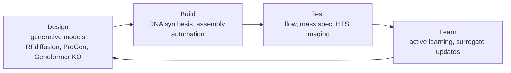

# Chapter 17 — Biotechnology & Bioengineering

> *"Engineering biology is increasingly an information-design problem; AI is the IDE."*

## Learning objectives

- Map the biotech design–build–test–learn (DBTL) cycle to ML primitives.
- Apply generative models to enzyme, antibody, and genetic-circuit design.
- Use active learning to minimize wet-lab cost.
- Address dual-use and biosafety implications explicitly.

## 17.1  The DBTL cycle, with AI at every stage



The empirical claim: a single closed DBTL loop with active learning typically reaches a target metric in 3–10× fewer rounds than open-loop screening.

## 17.2  Enzyme engineering

A high-yield recipe:

1. Train (or fine-tune) a PLM on the family of interest.
2. Score the wild-type sequence with zero-shot LLR (Chapter 8).
3. Generate variants conditioned on activity priors (UCB, conservative ESM-IF).
4. Express, purify, assay.
5. Update the surrogate; iterate.

OpenProtein, ProGen, and EvoBind have demonstrated 10–100× activity gains in 2–3 rounds for esterases, glycosyltransferases, and de novo binders.

## 17.3  Antibody design

The current state of the art:

- **Sequence-only**: AbLang2, IgLM, AbDiffuser propose CDR variants from training distributions of OAS / SAbDab.
- **Structure-aware**: RFdiffusion + IgFold for antibody:antigen interfaces.
- **Functional triage**: ESM-IF + RoseTTAFold-2 for binding pose scoring.

Hit rates for in-silico designed binders are climbing past 10 %, with sub-nM affinities reported.

## 17.4  Synthetic biology — genetic circuits

Treat a circuit as a typed program:

- **Promoters** = input ports.
- **Operators / aptamers** = guards.
- **CDS** = function bodies.
- **Terminators** = returns.

Cello and synBio-DBTL tools compile a Boolean specification to a DNA implementation; ML models predict circuit fold-change and dynamics, narrowing the build space before synthesis.

## 17.5  Worked example — active learning over a fitness landscape

```python
import numpy as np
from sklearn.gaussian_process import GaussianProcessRegressor
from sklearn.gaussian_process.kernels import Matern

def ucb_acquisition(model, X_pool, beta=2.0):
    mu, sigma = model.predict(X_pool, return_std=True)
    return mu + beta * sigma

def active_loop(X_labeled, y_labeled, X_pool, oracle, n_rounds=5, batch=8):
    for r in range(n_rounds):
        gp = GaussianProcessRegressor(kernel=Matern(nu=2.5)).fit(X_labeled, y_labeled)
        scores = ucb_acquisition(gp, X_pool)
        idx = np.argpartition(scores, -batch)[-batch:]
        new_X = X_pool[idx]; new_y = oracle(new_X)
        X_labeled = np.vstack([X_labeled, new_X])
        y_labeled = np.concatenate([y_labeled, new_y])
        X_pool = np.delete(X_pool, idx, axis=0)
    return X_labeled, y_labeled
```

`X_pool` is typically `n × d` PLM embeddings of candidate sequences; the `oracle` is your assay.

## 17.6  Biosafety and dual-use

Mandatory practices for any generative biology work:

- **Sequence screening** before synthesis (IGSC, SecureDNA, Aclid).
- **Refusal layer** in models exposing dangerous capabilities (pathogenic toxins, gain-of-function).
- **Logging and audit** of generation requests touching regulated agents.
- **Institutional review** (IBC, dual-use research of concern committees).

## 17.7  Exercises

1. **Active learning vs. random.** Reproduce a published DBTL benchmark (e.g. GFP, PhoQ). Compare UCB and random acquisition after 5 rounds.
2. **Antibody redesign.** Take a published anti-HER2 antibody; use IgLM to propose CDR3 variants; rescore with AlphaFold-Multimer.
3. **Circuit design.** Use Cello to design a 3-input NAND gate. Profile predicted vs. observed fold change (use Voigt lab data).
4. **Screening compliance.** Implement a sequence-screening check that flags any designed gene with > 80 % identity over 200 nt to a Select Agent.

## 17.8  Further reading

- Yang, K. K. *Machine-learning-guided directed evolution for protein engineering.* Nat. Methods (2019).
- Ruffolo, J. A. *IgLM.* Cell Systems (2023).
- Nielsen, A. A. K. *Cello: a genetic circuit design platform.* Science (2016).
- Carter, S. *Biosecurity in the age of AI.* (RAND, 2024).

## See also

- [Chapter 8 — Protein Structure & Design](chapter_08_protein.md)
- [Chapter 13 — Evolutionary Dynamics](chapter_13_evolution.md)
- [Drug discovery API](../api/drug_discovery.md)
