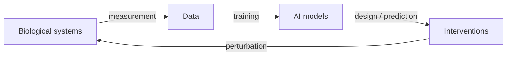

# Chapter 22 — Co-Evolution of AI & Life

> *"We are building tools trained on life, that we then use to redesign life — a feedback loop with no precedent."*

## Learning objectives

- Describe the feedback loops between biological data, AI models, and biological interventions.
- Reason about closed-loop "self-driving lab" systems and their stability.
- Connect evolutionary computation to AI-guided design (Chapters 13, 17) as two sides of one search problem.
- Identify where co-evolutionary dynamics create new risks and new scientific opportunities.

## 22.1  The loop, made explicit



Each traversal of this loop changes the *next* dataset. Models trained on AI-designed proteins, AI-curated literature, and AI-selected experiments increasingly learn from a world that earlier models shaped — a co-evolution of method and subject.

### 22.1a  The loop, made explicit — a quantitative model of feedback strength

The diagram above shows the qualitative loop. We can add a *quantitative* measure of loop strength: how much each iteration changes the distribution of data seen by the next generation of models.

Define the **loop gain** \( G \) as the expected change in the data distribution per iteration relative to the initial diversity. If \( G > 1 \), the loop amplifies initial biases; if \( G < 1 \), it stabilizes (narrows) the distribution.

**Example: a protein-design loop.**

- *Iteration 0.* Model trained on natural sequences (e.g., UniRef). Data diversity is high.
- *Iteration 1.* Model generates 10,000 novel sequences. The lab tests 1,000. The top 100 become new training data.
- Loop gain = (diversity of top 100) / (diversity of natural sequences). This is often \( < 1 \) because selection narrows to a high-fitness region.

We can simulate diversity loss using sequence identity as a proxy:

```python
import numpy as np
from scipy.spatial.distance import pdist

def sequence_diversity(seqs, metric='hamming'):
    """Mean pairwise distance (0..1) among a list of equal-length sequences."""
    # Convert to integer array (A=0, C=1, G=2, T=3)
    arr = np.array([[{'A': 0, 'C': 1, 'G': 2, 'T': 3}[c] for c in seq]
                    for seq in seqs])
    if metric == 'hamming':
        dists = pdist(arr, metric='hamming')
    else:
        dists = pdist(arr, metric='euclidean') / arr.shape[1]  # normalize
    return float(np.mean(dists))

# Simulate: initial natural sequences
natural = [...]   # list of 1000 sequences
div_natural = sequence_diversity(natural)

# After one round of design + selection
designed = [...]  # top 100 from generative model
div_designed = sequence_diversity(designed)

gain = div_designed / div_natural
print(f"Loop gain: {gain:.2f}")
```

**Interpretation.** If gain \( < 0.5 \), the loop is rapidly narrowing the sequence space. This is efficient for optimization but risks losing diversity that might be useful for future tasks (novel functions, robustness). Monitoring loop gain is a diagnostic for healthy co-evolution.

**Pitfall.** Low diversity can also result from a badly calibrated generative model (mode collapse), not just selection. Compare to a control where you randomly sample from the generator *without* fitness selection.

## 22.2  Self-driving labs

A closed-loop autonomous lab couples design, robotic execution, and learning:

1. **Propose** — a generative model or active-learner suggests experiments (Chapter 18).
2. **Execute** — liquid handlers, plate readers, and automated synthesis run them.
3. **Measure** — instruments return structured results.
4. **Update** — the surrogate retrains; the next batch is proposed.

Reported speed-ups of 5–100× in materials and biochemistry come from removing human latency between rounds — but stability depends entirely on calibration of the surrogate's uncertainty.

### 22.2a  Self-driving labs — a modular architecture with feedback stabilizers

We can make the self-driving lab (SDL) concrete with a *modular software architecture* and ask a sharper question: when does an SDL converge versus diverge?

**Architecture components** (implementable with workflow engines such as `prefect`, `airflow`, or serving frameworks like `bentoml`):

1. **Design module** — a generative model (e.g., RFdiffusion, ProGen) proposes candidates.
2. **Acquisition module** — active learning (UCB, Thompson sampling) selects the batch to run.
3. **Execution module** — a robotic liquid handler (Opentrons, Tecan) driven via a REST API.
4. **Measurement module** — a plate reader, mass spec, or flow cytometer returns structured data.
5. **Learning module** — updates the surrogate model (a GP or a PLM head) with the new data.

**Stability condition.** The surrogate's uncertainty must be well-calibrated. If the surrogate is overconfident, the SDL will repeatedly select predicted highs that are actually lows, and performance stagnates — or diverges if the surrogate's errors compound.

**Diagnostic.** After each round, compute the calibration curve of the surrogate on the newly measured variants. If the slope is \( < 0.7 \) (predicted confidence much higher than observed accuracy), reduce the acquisition function's exploration parameter or switch to an ensemble.

A minimal stability monitor:

```python
import numpy as np

def check_calibration(y_true, y_pred_mean, y_pred_std):
    """y_pred_mean is the surrogate's prediction, y_pred_std its uncertainty."""
    # Fraction of true values that fall within 1 sigma of the prediction
    within_1sigma = np.mean(np.abs(y_true - y_pred_mean) <= y_pred_std)
    expected_within_1sigma = 0.6827  # for a normal distribution
    calibration_ratio = within_1sigma / expected_within_1sigma
    if calibration_ratio < 0.8:
        print("Warning: surrogate overconfident (calibration ratio <0.8)")
    elif calibration_ratio > 1.2:
        print("Warning: surrogate underconfident (calibration ratio >1.2)")
    return calibration_ratio
```

**Pitfall.** SDLs require tight hardware/software integration. A common failure is the "garbage in, garbage out" loop: if the measurement module has systematic error (e.g., plate-reader drift), the surrogate learns the error and the SDL optimizes for the wrong objective. Always run control experiments — known positive and negative controls in every batch — to detect drift.

## 22.3  Evolution and learning are the same search

| Evolutionary computation | Gradient / Bayesian learning |
|--------------------------|------------------------------|
| Population of variants | Batch of candidates |
| Mutation + recombination | Proposal distribution |
| Selection by fitness | Acquisition by predicted value |
| Generations | Rounds |

Directed evolution (Chapter 13) and ML-guided design (Chapter 17) are two parameterizations of the same explore–exploit problem over a fitness landscape. Hybrids — using a PLM prior to seed a population and a surrogate to triage it — outperform either alone.

### 22.3a  Evolution and learning are the same search — a unified view with code

Because directed evolution and ML-guided design are two sides of the same explore–exploit coin, we can implement a **hybrid algorithm** that combines a genetic algorithm (evolution) with a surrogate model (learning).

**Evolutionary surrogate-assisted optimization.**

1. Initialize a population of \( N \) sequences (e.g., wild-type plus random mutants).
2. For each generation:
   - Evaluate all individuals in the population (wet-lab or oracle).
   - Train a surrogate model on all evaluated sequences.
   - Use the surrogate to propose offspring *without* real evaluation: sample many mutants, predict fitness, keep the top \( M \).
   - Add a small number of randomly mutated individuals (exploration).
   - Combine real-evaluated top performers and surrogate-selected candidates into the next generation.
3. Repeat.

```python
import numpy as np
from sklearn.gaussian_process import GaussianProcessRegressor

def hybrid_evolution(oracle, initial_pop, n_generations=10, pop_size=100,
                     mutation_rate=0.05, n_surrogate_proposals=50):
    population = list(initial_pop)
    fitness = [oracle(seq) for seq in population]
    history = [max(fitness)]

    for _ in range(n_generations):
        # Train surrogate on all evaluated data (embeddings per sequence)
        X = np.array([get_embedding(seq) for seq in population])
        y = np.array(fitness)
        gp = GaussianProcessRegressor().fit(X, y)

        # Generate candidate mutants from the top 20% of the population
        top_idx = np.argsort(fitness)[-int(0.2 * pop_size):]
        candidates = []
        for idx in top_idx:
            for _ in range(n_surrogate_proposals // len(top_idx)):
                candidates.append(mutate(population[idx], rate=mutation_rate))

        # Score candidates with the surrogate, select the best M
        X_cand = np.array([get_embedding(seq) for seq in candidates])
        scores = gp.predict(X_cand)
        best_cand_idx = np.argsort(scores)[-n_surrogate_proposals:]
        selected_candidates = [candidates[i] for i in best_cand_idx]

        # Random mutants for exploration
        random_mutants = [mutate(np.random.choice(population), rate=mutation_rate * 2)
                          for _ in range(pop_size // 10)]

        # New population = top current + surrogate-selected + random mutants
        top_current = [population[i] for i in np.argsort(fitness)[-pop_size // 2:]]
        new_population = top_current + selected_candidates + random_mutants

        # Evaluate only the genuinely new sequences (oracle calls are costly)
        seen = set(population)
        for seq in new_population:
            if seq not in seen:
                population.append(seq)
                fitness.append(oracle(seq))
                seen.add(seq)
        history.append(max(fitness))
    return population, fitness, history
```

**Comparison.** On a simple landscape, this hybrid often converges to the optimum in fewer generations than a pure genetic algorithm, and in fewer oracle evaluations than pure Bayesian optimization.

**Pitfall.** The surrogate may become overconfident about unseen regions. Always keep a fraction of random mutations in the population to avoid premature convergence.

## 22.4  Worked example — a minimal closed loop

```python
import numpy as np

def closed_loop(fitness, propose, surrogate_fit, acquire,
                init_X, init_y, rounds: int = 8, batch: int = 16):
    """Design -> measure -> learn loop over a discrete candidate space."""
    X, y = init_X, init_y
    best = [y.max()]
    for _ in range(rounds):
        model = surrogate_fit(X, y)         # learn from all data so far
        cand = propose(X)                   # generate fresh candidates
        idx = acquire(model, cand)[:batch]  # pick the most informative
        new_X = cand[idx]
        new_y = np.array([fitness(x) for x in new_X])   # the wet-lab oracle
        X = np.vstack([X, new_X]); y = np.concatenate([y, new_y])
        best.append(y.max())
    return X, y, best                        # best-so-far traces the loop's gain
```

The `best`-so-far curve is the diagnostic: a healthy loop climbs and then plateaus as the landscape is exhausted; a *miscalibrated* (overconfident) loop climbs on its own optimistic errors and fails to replicate.

### 22.4a  Worked example extension — a minimal closed loop with realistic noise

The loop above uses a deterministic oracle. Real wet-lab measurements carry **noise** and **drift**; adding both makes the simulation more honest.

A noisy oracle with day-to-day drift:

```python
import numpy as np

def noisy_oracle(seq, base_landscape, current_day=0,
                 drift_factor=0.01, noise_std=0.05):
    """Fitness measurement with random noise and systematic drift over time."""
    true_fitness = base_landscape(seq)        # ground truth
    noise = np.random.normal(0, noise_std)    # random measurement noise
    drift = drift_factor * current_day        # systematic day-to-day drift
    return true_fitness + noise + drift
```

A closed loop with uncertainty-aware acquisition (a GP with heteroscedastic noise):

```python
def closed_loop_with_noise(fitness, propose, surrogate_fit, acquire,
                           init_X, init_y, rounds=8, batch=16, noise_std=0.05):
    X, y = init_X, init_y
    best = [y.max()]
    for _ in range(rounds):
        # Fit a surrogate that accounts for input-dependent noise
        model = surrogate_fit(X, y, noise_std=noise_std)  # e.g., GP + WhiteKernel
        cand = propose(X)
        scores = acquire(model, cand)        # UCB: balances mean and variance
        idx = np.argsort(scores)[-batch:]
        new_X = cand[idx]
        new_y = np.array([fitness(x) for x in new_X])
        X = np.vstack([X, new_X])
        y = np.concatenate([y, new_y])
        best.append(y.max())
    return X, y, best
```

**Takeaway.** Under noise, acquisition functions that balance mean and variance (UCB) are essential; pure exploitation converges to a noisy plateau, not the true optimum. Replicates reduce noise but cost more — active learning should decide *when* replication is worthwhile.

**Pitfall.** Drift violates the stationarity assumption of most surrogates. Mitigate with periodic recalibration (re-measure a control variant every day) and subtract the estimated drift from all measurements.

## 22.5  New risks from the loop

- **Feedback contamination.** Models trained on AI-generated sequences can amplify their own biases (a biological analogue of model collapse).
- **Runaway optimization.** A closed loop optimizing a proxy can drift from the true objective faster than humans can intervene.
- **Provenance loss.** When designs, data, and labels are all machine-mediated, reconstructing *why* a result holds becomes hard.

### 22.5a  New risks from the loop — detection methods and safeguards

The two headline risks — feedback contamination and runaway optimization — both admit concrete detection methods.

**Feedback contamination** occurs when a model is trained on data generated by a previous version of itself, amplifying biases. *Detection:* train two models — one on original natural data only, one on original plus AI-generated data — and compare them on a held-out *natural* test set. If the model trained on generated data performs worse, contamination is occurring.

**Runaway optimization** happens when a closed loop optimizes a proxy metric that diverges from the true objective (e.g., optimizing fluorescence while losing protein solubility). *Detection:* periodically measure the true objective on a random subset of designs. If the proxy keeps improving while the true objective plateaus or declines, stop the loop and recalibrate.

A safeguard that watches for runaway divergence:

```python
class RunawayDetector:
    def __init__(self, true_objective_function, check_every=2):
        self.true_obj = true_objective_function
        self.check_every = check_every
        self.proxy_history = []
        self.true_history = []

    def update(self, proxy_score, design):
        self.proxy_history.append(proxy_score)
        if len(self.proxy_history) % self.check_every == 0:
            true_score = self.true_obj(design)
            self.true_history.append(true_score)
            if len(self.true_history) > 1:
                proxy_trend = self.proxy_history[-1] - self.proxy_history[-2]
                true_trend = self.true_history[-1] - self.true_history[-2]
                if proxy_trend > 0 and true_trend < -0.05 * abs(true_score):
                    raise RuntimeError(
                        "Runaway optimization detected: "
                        "proxy improving, true objective declining.")
```

**Pitfall.** The true objective may be expensive or impossible to measure frequently. Use a cheaper correlated assay as a proxy for early warning, with occasional full validation.

## 22.6  New opportunities

- **Continual atlases** that improve as instruments and models co-advance.
- **Counterfactual biology** — simulate perturbations before performing them.
- **Compression of discovery** — months of iteration collapse into days.

### 22.6a  New opportunities — continual atlases and counterfactual biology

Two of these opportunities are concrete enough to prototype.

**Continual atlas of protein structures.** A model (e.g., AlphaFold) is periodically retrained on newly solved structures and then predicts structures for related proteins never solved. This creates a positive feedback loop: better structures → better training data → even better predictions. *Research question:* how often should you retrain? Use online (continual) learning to avoid catastrophic forgetting of rare folds.

**Counterfactual biology.** Given a trained model (e.g., a gene-regulatory-network surrogate), ask "What would happen if I knocked out gene X?" without doing the experiment. Generate thousands of counterfactuals and prioritize the most informative for validation:

```python
import numpy as np

def counterfactual_priority(model, base_state, perturbations,
                            effect_metric='expression_change'):
    """Rank perturbations by expected impact according to the model."""
    base_pred = model.predict(base_state)
    scores = []
    for pert in perturbations:
        perturbed_state = apply_perturbation(base_state, pert)
        pert_pred = model.predict(perturbed_state)
        effect = np.abs(pert_pred - base_pred).sum()      # or a specific gene
        # High model uncertainty implies high information gain
        uncertainty = model.predict_uncertainty(perturbed_state)
        score = effect + 0.5 * uncertainty                # exploration bonus
        scores.append(score)
    return sorted(zip(perturbations, scores), key=lambda x: x[1], reverse=True)
```

**Pitfall.** Counterfactual predictions are only as good as the model's extrapolation ability. Always validate the top 2–3 counterfactuals experimentally before trusting the rest.

## 22.7  Pitfalls

- **Mistaking speed for understanding.** A faster loop that no one can explain is fragile.
- **Uncalibrated autonomy.** Removing the human before the surrogate's uncertainty is trustworthy.
- **Benchmark inbreeding.** Evaluating loop outputs only against data the loop generated.

### 22.7a  Extended pitfalls — mistaking speed for understanding, uncalibrated autonomy

**Mistaking speed for understanding.** A self-driving lab can produce 10,000 designs per week, but if no human understands *why* certain designs work, the knowledge is brittle. When the environment changes (e.g., a new strain of the host organism), the SDL must re-learn from scratch. *Solution:* force interpretability — for every design, require the surrogate to output not just a prediction but also the top-3 contributing features (specific residues or motifs), and log these for human review.

**Uncalibrated autonomy.** Removing the human from the loop before the surrogate's uncertainty is trustworthy leads to silent failures. A graded ladder of safe autonomy levels:

| Level | Description | Human role | When appropriate |
|-------|-------------|------------|------------------|
| 0 | No AI | Manual | Initial exploration |
| 1 | AI proposes, human approves | Vet each proposal | Surrogate calibration unknown |
| 2 | AI selects, human reviews batch | Spot-check a random subset | Calibration verified on held-out set |
| 3 | Fully autonomous, with alarms | Notified only on anomalies | High confidence, low cost of error |

**Pitfall.** Many systems jump from Level 1 to Level 3 without Level 2 validation. Use Level 2 for at least one full iteration before going fully autonomous.

## 22.8  Exercises

1. **Loop stability.** Run `closed_loop` with a deliberately overconfident surrogate. Show how best-so-far diverges from true fitness.
2. **EC vs. BO.** On a shared fitness landscape, compare a genetic algorithm and Bayesian optimization for sample efficiency.
3. **Model collapse.** Iteratively train a sequence model on its own samples. Quantify diversity loss over generations.
4. **Provenance ledger.** Design a metadata schema that records, for each design, which model and data version produced it.
5. **Loop gain on a realistic fitness landscape.** Use the ProteinGym `BLAT_ECOLX` landscape. Simulate an iterative design loop: start with 96 random single mutants, train a GP, select the top 96 UCB candidates (no wet-lab budget limit), and add them to training. Compute sequence diversity after each round and plot diversity versus round. Does diversity drop quickly? At what round does the loop gain fall below 0.5?
6. **Self-driving lab simulator.** Write a simulator for a small-molecule optimization task (e.g., solubility + toxicity). Implement an SDL with a GP surrogate and UCB acquisition, add realistic noise and drift, and tune the exploration parameter to maximize convergence speed without runaway. Compare to a random-search baseline.
7. **Hybrid evolution vs. pure GA.** On a rugged fitness landscape (e.g., an NK model), compare a pure genetic algorithm (mutation + crossover only) to the hybrid surrogate-assisted algorithm above, using the same number of oracle calls. Which finds a higher peak? Which is more robust to noise?
8. **Counterfactual prioritization for a metabolic model.** Use a published genome-scale metabolic model (e.g., *E. coli* iJO1366). Generate 100 single-gene knockouts and use flux balance analysis (FBA) to compute growth rate as ground truth. Train a surrogate neural network to predict growth rate from (simulated) gene-expression features, then use counterfactual prioritization to rank knockouts by predicted effect. Compared with random selection, how many knockouts must you test to find the top 5 growth-enhancing deletions?

## 22.9  Further reading

- Coley, C. W. *A robotic platform for flow synthesis (self-driving labs).* Science (2019).
- Hie, B. *Adaptive machine learning for protein engineering.* Curr. Opin. Struct. Biol. (2022).
- Shumailov, I. *The curse of recursion: training on generated data.* (2023).
- Stanley, K. O. *Designing neural networks through neuroevolution.* Nat. Mach. Intell. (2019).
- King, R. D. et al. *Automated scientific discovery: from self-driving labs to autonomous research.* Nat. Rev. Phys. (2024) — review with case studies.
- Lehman, J. et al. *The surprising creativity of digital evolution.* Artif. Life (2020) — evolutionary algorithms in design.
- Shumailov, I. et al. *The curse of recursion: training on generated data.* Nature (2024) — empirical demonstration of model collapse.
- Hie, B. L. et al. *Adaptive machine learning for protein engineering.* Curr. Opin. Struct. Biol. (2022) — practical guidance on closed-loop design.

## See also

- [Chapter 13 — Evolutionary Dynamics](chapter_13_evolution.md)
- [Chapter 17 — Biotechnology & Bioengineering](chapter_17_biotech.md)
- [Chapter 23 — Limits & Open Questions](chapter_23_limits.md)


---
<sub>Support DaScient, Inc. (a non-profit promoting accessible intelligence and community learning) via [Donations](https://cash.app/dascient/).</sub>
