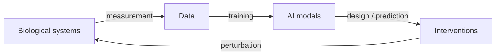

# Chapter 22 — Co-Evolution of AI & Life

> *"We are building tools trained on life, that we then use to redesign life — a feedback loop with no precedent."*

## Learning objectives

- Describe the feedback loops between biological data, AI models, and biological interventions.
- Reason about closed-loop "self-driving lab" systems and their stability.
- Connect evolutionary computation to AI-guided design (Chapters 13, 17) as two sides of one search problem.
- Identify where co-evolutionary dynamics create new risks and new scientific opportunities.

## 22.1  The loop, made explicit



Each traversal of this loop changes the *next* dataset. Models trained on AI-designed proteins, AI-curated literature, and AI-selected experiments increasingly learn from a world that earlier models shaped — a co-evolution of method and subject.

## 22.2  Self-driving labs

A closed-loop autonomous lab couples design, robotic execution, and learning:

1. **Propose** — a generative model or active-learner suggests experiments (Chapter 18).
2. **Execute** — liquid handlers, plate readers, and automated synthesis run them.
3. **Measure** — instruments return structured results.
4. **Update** — the surrogate retrains; the next batch is proposed.

Reported speed-ups of 5–100× in materials and biochemistry come from removing human latency between rounds — but stability depends entirely on calibration of the surrogate's uncertainty.

## 22.3  Evolution and learning are the same search

| Evolutionary computation | Gradient / Bayesian learning |
|--------------------------|------------------------------|
| Population of variants | Batch of candidates |
| Mutation + recombination | Proposal distribution |
| Selection by fitness | Acquisition by predicted value |
| Generations | Rounds |

Directed evolution (Chapter 13) and ML-guided design (Chapter 17) are two parameterizations of the same explore–exploit problem over a fitness landscape. Hybrids — using a PLM prior to seed a population and a surrogate to triage it — outperform either alone.

## 22.4  Worked example — a minimal closed loop

```python
import numpy as np

def closed_loop(fitness, propose, surrogate_fit, acquire,
                init_X, init_y, rounds: int = 8, batch: int = 16):
    """Design -> measure -> learn loop over a discrete candidate space."""
    X, y = init_X, init_y
    best = [y.max()]
    for _ in range(rounds):
        model = surrogate_fit(X, y)         # learn from all data so far
        cand = propose(X)                   # generate fresh candidates
        idx = acquire(model, cand)[:batch]  # pick the most informative
        new_X = cand[idx]
        new_y = np.array([fitness(x) for x in new_X])   # the wet-lab oracle
        X = np.vstack([X, new_X]); y = np.concatenate([y, new_y])
        best.append(y.max())
    return X, y, best                        # best-so-far traces the loop's gain
```

The `best`-so-far curve is the diagnostic: a healthy loop climbs and then plateaus as the landscape is exhausted; a *poisoned* loop climbs on its own optimistic errors and fails to replicate.

## 22.5  New risks from the loop

- **Feedback contamination.** Models trained on AI-generated sequences can amplify their own biases (a biological analogue of model collapse).
- **Runaway optimization.** A closed loop optimizing a proxy can drift from the true objective faster than humans can intervene.
- **Provenance loss.** When designs, data, and labels are all machine-mediated, reconstructing *why* a result holds becomes hard.

## 22.6  New opportunities

- **Continual atlases** that improve as instruments and models co-advance.
- **Counterfactual biology** — simulate perturbations before performing them.
- **Compression of discovery** — months of iteration collapse into days.

## 22.7  Pitfalls

- **Mistaking speed for understanding.** A faster loop that no one can explain is fragile.
- **Uncalibrated autonomy.** Removing the human before the surrogate's uncertainty is trustworthy.
- **Benchmark inbreeding.** Evaluating loop outputs only against data the loop generated.

## 22.8  Exercises

1. **Loop stability.** Run `closed_loop` with a deliberately overconfident surrogate. Show how best-so-far diverges from true fitness.
2. **EC vs. BO.** On a shared fitness landscape, compare a genetic algorithm and Bayesian optimization for sample efficiency.
3. **Model collapse.** Iteratively train a sequence model on its own samples. Quantify diversity loss over generations.
4. **Provenance ledger.** Design a metadata schema that records, for each design, which model and data version produced it.

## 22.9  Further reading

- Coley, C. W. *A robotic platform for flow synthesis (self-driving labs).* Science (2019).
- Hie, B. *Adaptive machine learning for protein engineering.* Curr. Opin. Struct. Biol. (2022).
- Shumailov, I. *The curse of recursion: training on generated data.* (2023).
- Stanley, K. O. *Designing neural networks through neuroevolution.* Nat. Mach. Intell. (2019).

## See also

- [Chapter 13 — Evolutionary Dynamics](chapter_13_evolution.md)
- [Chapter 17 — Biotechnology & Bioengineering](chapter_17_biotech.md)
- [Chapter 23 — Limits & Open Questions](chapter_23_limits.md)
