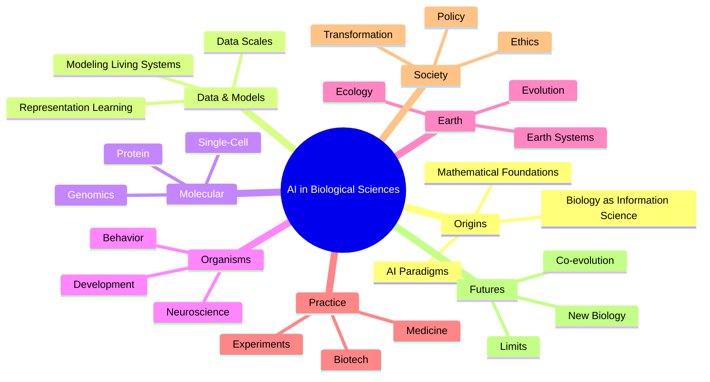

# AI in Biological Sciences

Welcome to the documentation for the **AI in Biological Sciences** textbook companion repository.

This site provides:

- Chapter-by-chapter reference pages
- API documentation for all biological AI endpoints
- Interactive tutorials
- Worked examples in Python, R, and Julia

## Getting Started

```bash
git clone https://github.com/DaScient/ai-in-biology.git
cd ai-in-biology
pip install -e ".[dev,docs]"
```

See the [Quick Start](tutorials/quickstart.md) tutorial to run your first analysis.

## Quick Links

<div class="grid cards" markdown>

-   :material-dna:{ .lg .middle } __Protein Structure Prediction__

    ---

    Predict 3D structure from sequence with the `/protein/fold` endpoint.

    [:octicons-arrow-right-24: Tutorial](tutorials/protein_folding.md)

-   :material-chart-scatter-plot:{ .lg .middle } __Genomics Analysis__

    ---

    Variant-effect prediction and sequence modeling.

    [:octicons-arrow-right-24: Tutorial](tutorials/genomics_analysis.md)

-   :material-microscope:{ .lg .middle } __Single-Cell Intelligence__

    ---

    Embed cells, infer trajectories, annotate types.

    [:octicons-arrow-right-24: API](api/single_cell.md)

-   :material-leaf:{ .lg .middle } __Ecology & SDM__

    ---

    Species distribution modeling under environmental change.

    [:octicons-arrow-right-24: API](api/ecology.md)

</div>

## Textbook Structure



## Chapter Notebooks

| Chapter | Topic | Source |
|---------|-------|--------|
| 1 | Biology as Information Science | [chapter 01](chapters/chapter_01_bioinfo_basics.md) |
| 2 | DNA Language Models | [chapter 02](chapters/chapter_02_dna_language_models.md) |
| 3 | Attention in Genomics | [chapter 03](chapters/chapter_03_attention_in_genomics.md) |
| 8 | Protein Structure & Design | [chapter 08](chapters/chapter_08_protein.md) |
| 9 | Single-Cell Intelligence | [chapter 09](chapters/chapter_09_single_cell.md) |

## About

This repository accompanies the textbook  
**"AI in Biological Sciences: Theory, Applications, Practice, and Society"**  
(DaScient Press, 2025) by Dr. Aris Thorne, Wei Chen, and Marcus Adebayo.
